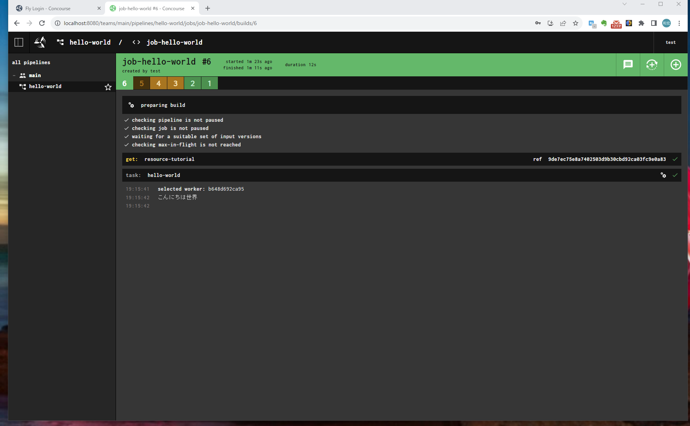

# ConcourseCI-install
Concourse CI のインストール手順

## 参考
- ConcourseCI は v3.19以上のカーネルが必要。カーネル更新手順は以下を参考にする

    https://qiita.com/ryoctrl/items/8f786d3ccb2333ffc4d0


-  Concourse CI のインストール手順

    https://note.com/shift_tech/n/nead03c02b095


- Concourse CI のチュートリアル

    https://concoursetutorial-ja.site.lkj.io/


## 前提

- 以下の資料に従って harborをインストール済

    https://github.com/moriyamaES/harbor-install#readme


## 環境

```
# uname -r
3.10.0-1160.el7.x86_64
```

```
# minikube version 
minikube version: v1.21.0
commit: 76d74191d82c47883dc7e1319ef7cebd3e00ee11
```

```
# docker version 
Client: Docker Engine - Community
 Version:           20.10.7
 API version:       1.41
 Go version:        go1.13.15
 Git commit:        f0df350
 Built:             Wed Jun  2 11:58:10 2021
 OS/Arch:           linux/amd64
 Context:           default
 Experimental:      true

Server: Docker Engine - Community
 Engine:
  Version:          20.10.7
  API version:      1.41 (minimum version 1.12)
  Go version:       go1.13.15
  Git commit:       b0f5bc3
  Built:            Wed Jun  2 11:56:35 2021
  OS/Arch:          linux/amd64
  Experimental:     false
 containerd:
  Version:          1.4.6
  GitCommit:        d71fcd7d8303cbf684402823e425e9dd2e99285d
 runc:
  Version:          1.0.0-rc95
  GitCommit:        b9ee9c6314599f1b4a7f497e1f1f856fe433d3b7
 docker-init:
  Version:          0.19.0
  GitCommit:        de40ad0
```
```
# docker-compose version
Docker Compose version v2.20.3
```

## カーネルアップデート

- ConcourseCI は v3.19以上のカーネルが必要。
- カーネルのバージョンをチェック

```
# uname -r
3.10.0-1160.el7.x86_64
```
```
# rpm -qa | grep "^kernel" | sort
kernel-3.10.0-1160.el7.x86_64
kernel-tools-3.10.0-1160.el7.x86_64
kernel-tools-libs-3.10.0-1160.el7.x86_64
```

- 3.10で要求を満たしていないのでカーネルをアップデートします。

- ELRepoを追加します。
- ELRepoにもバージョンがあるので[公式ページ](http://elrepo.org/tiki/tiki-index.php)を参考にしながらコマンドを実行していきます。
 ※ ここでは、[参考資料](https://qiita.com/ryoctrl/items/8f786d3ccb2333ffc4d0)の手順に従った

```
# rpm --import https://www.elrepo.org/RPM-GPG-KEY-elrepo.org
```
```
# rpm -Uvh https://www.elrepo.org/elrepo-release-7.0-3.el7.elrepo.noarch.rpm
```
- 結果
```
https://www.elrepo.org/elrepo-release-7.0-3.el7.elrepo.noarch.rpm を取得中
準備しています...                                                (################################# [100%]
更新中 / インストール中...
   1:elrepo-release-7.0-3.el7.elrepo                              ################################# [100%]
```
```
# cat /etc/yum.repos.d/elrepo.repo
```
- 結果
```
### Name: ELRepo.org Community Enterprise Linux Repository for el7
### URL: http://elrepo.org/

[elrepo]
name=ELRepo.org Community Enterprise Linux Repository - el7
baseurl=http://elrepo.org/linux/elrepo/el7/$basearch/
        http://mirrors.coreix.net/elrepo/elrepo/el7/$basearch/
        http://mirror.rackspace.com/elrepo/elrepo/el7/$basearch/
        http://repos.lax-noc.com/elrepo/elrepo/el7/$basearch/
        http://mirror.ventraip.net.au/elrepo/elrepo/el7/$basearch/
mirrorlist=http://mirrors.elrepo.org/mirrors-elrepo.el7
enabled=1
gpgcheck=1
gpgkey=file:///etc/pki/rpm-gpg/RPM-GPG-KEY-elrepo.org
protect=0

[elrepo-testing]
name=ELRepo.org Community Enterprise Linux Testing Repository - el7
baseurl=http://elrepo.org/linux/testing/el7/$basearch/
        http://mirrors.coreix.net/elrepo/testing/el7/$basearch/
        http://mirror.rackspace.com/elrepo/testing/el7/$basearch/
        http://repos.lax-noc.com/elrepo/testing/el7/$basearch/
        http://mirror.ventraip.net.au/elrepo/testing/el7/$basearch/
mirrorlist=http://mirrors.elrepo.org/mirrors-elrepo-testing.el7
enabled=0
gpgcheck=1
gpgkey=file:///etc/pki/rpm-gpg/RPM-GPG-KEY-elrepo.org
protect=0

[elrepo-kernel]
name=ELRepo.org Community Enterprise Linux Kernel Repository - el7
baseurl=http://elrepo.org/linux/kernel/el7/$basearch/
        http://mirrors.coreix.net/elrepo/kernel/el7/$basearch/
        http://mirror.rackspace.com/elrepo/kernel/el7/$basearch/
        http://repos.lax-noc.com/elrepo/kernel/el7/$basearch/
        http://mirror.ventraip.net.au/elrepo/kernel/el7/$basearch/
mirrorlist=http://mirrors.elrepo.org/mirrors-elrepo-kernel.el7
enabled=0
gpgcheck=1
gpgkey=file:///etc/pki/rpm-gpg/RPM-GPG-KEY-elrepo.org
protect=0

[elrepo-extras]
name=ELRepo.org Community Enterprise Linux Extras Repository - el7
baseurl=http://elrepo.org/linux/extras/el7/$basearch/
        http://mirrors.coreix.net/elrepo/extras/el7/$basearch/
        http://mirror.rackspace.com/elrepo/extras/el7/$basearch/
        http://repos.lax-noc.com/elrepo/extras/el7/$basearch/
        http://mirror.ventraip.net.au/elrepo/extras/el7/$basearch/
mirrorlist=http://mirrors.elrepo.org/mirrors-elrepo-extras.el7
enabled=0
gpgcheck=1
gpgkey=file:///etc/pki/rpm-gpg/RPM-GPG-KEY-elrepo.org
protect=0
```

- ELRepoが追加出来たら、以下を実行

```
# yum --enablerepo=elrepo-kernel -y install kernel-ml
```
- 結果
```
読み込んだプラグイン:fastestmirror, langpacks
Loading mirror speeds from cached hostfile
 * base: ftp.tsukuba.wide.ad.jp
 * elrepo: ftp.ne.jp
 * elrepo-kernel: ftp.ne.jp
 * extras: ftp.tsukuba.wide.ad.jp
 * updates: ftp.tsukuba.wide.ad.jp
base                                       | 3.6 kB     00:00     
docker-ce-stable                           | 3.5 kB     00:00     
elrepo                                     | 3.0 kB     00:00     
elrepo-kernel                              | 3.0 kB     00:00     
extras                                     | 2.9 kB     00:00     
ius                                        | 1.3 kB     00:00     
updates                                    | 2.9 kB     00:00     
(1/2): elrepo/primary_db                     | 357 kB   00:00     
(2/2): elrepo-kernel/primary_db              | 2.1 MB   00:00     
依存性の解決をしています
--> トランザクションの確認を実行しています。
---> パッケージ kernel-ml.x86_64 0:6.4.10-1.el7.elrepo を インストール
--> 依存性解決を終了しました。

依存性を解決しました

==================================================================
 Package     アーキテクチャー
                      バージョン            リポジトリー     容量
==================================================================
インストール中:
 kernel-ml   x86_64   6.4.10-1.el7.elrepo   elrepo-kernel    66 M

トランザクションの要約
==================================================================
インストール  1 パッケージ

総ダウンロード容量: 66 M
インストール容量: 339 M
Downloading packages:
kernel-ml-6.4.10-1.el7.elrepo.x86_64.rpm     |  66 MB   00:07     
Running transaction check
Running transaction test
Transaction test succeeded
Running transaction
警告: RPMDB は yum 以外で変更されました。
  インストール中          : kernel-ml-6.4.10-1.el7.elrepo.x   1/1 
  検証中                  : kernel-ml-6.4.10-1.el7.elrepo.x   1/1 

インストール:
  kernel-ml.x86_64 0:6.4.10-1.el7.elrepo                          

完了しました!
```
- 更新内容を確認
```
# rpm -qa | grep "^kernel" | sort
kernel-3.10.0-1160.el7.x86_64
kernel-ml-6.4.10-1.el7.elrepo.x86_64
kernel-tools-3.10.0-1160.el7.x86_64
kernel-tools-libs-3.10.0-1160.el7.x86_64
```
- kernel-mlが更新されていればOKです。

- このままだと次回の再起動時は元の古いカーネルで起動されてしまうため起動設定を変えます。

```
# grub2-editenv list
saved_entry=CentOS Linux (3.10.0-1160.el7.x86_64) 7 (Core)
```

```
# awk -F\' '$1=="menuentry " {print i++ " : " $2}' /etc/grub2.cfg
0 : CentOS Linux (6.4.10-1.el7.elrepo.x86_64) 7 (Core)
1 : CentOS Linux (3.10.0-1160.el7.x86_64) 7 (Core)
2 : CentOS Linux (0-rescue-b89cc28406e54592a5591681ba669192) 7 (Core)
```

- 今回更新した6.4.10で起動したいので0をsetします。

```
# grub2-set-default 0
```

- カーネルヘッダやツールを一つずつ入れ替えていきます

    ```
    # yum --enablerepo=elrepo-kernel -y swap kernel-headers -- kernel-ml-headers
    ```


    - 結果

        ```
        読み込んだプラグイン:fastestmirror, langpacks
        引数に一致しません: kernel-headers
        swap remove kernel-headers
        ```


    ```
    # yum --enablerepo=elrepo-kernel -y swap kernel-tools-libs -- kernel-ml-tools-libs
    ```

    - 結果

        ```
        読み込んだプラグイン:fastestmirror, langpacks
        Loading mirror speeds from cached hostfile
        * base: ftp.tsukuba.wide.ad.jp
        * elrepo: ftp.ne.jp
        * elrepo-kernel: ftp.ne.jp
        * extras: ftp.tsukuba.wide.ad.jp
        * updates: ftp.tsukuba.wide.ad.jp
        依存性の解決をしています
        --> トランザクションの確認を実行しています。
        ---> パッケージ kernel-ml-tools-libs.x86_64 0:6.4.10-1.el7.elrepo を インストール
        ---> パッケージ kernel-tools-libs.x86_64 0:3.10.0-1160.el7 を 削除
        --> 依存性の処理をしています: kernel-tools-libs = 3.10.0-1160.el7 のパッケージ: kernel-tools-3.10.0-1160.el7.x86_64
        --> トランザクションの確認を実行しています。
        ---> パッケージ kernel-tools.x86_64 0:3.10.0-1160.el7 を 削除
        --> 依存性解決を終了しました。

        依存性を解決しました

        ==================================================================
        Package           アーキテクチャー
                                バージョン          リポジトリー   容量
        ==================================================================
        インストール中:
        kernel-ml-tools-libs
                        x86_64 6.4.10-1.el7.elrepo elrepo-kernel 183 k
        削除中:
        kernel-tools-libs x86_64 3.10.0-1160.el7     @anaconda      18 k
        依存性関連での削除をします:
        kernel-tools      x86_64 3.10.0-1160.el7     @anaconda     337 k

        トランザクションの要約
        ==================================================================
        インストール  1 パッケージ
        削除          1 パッケージ (+1 個の依存関係のパッケージ)

        総ダウンロード容量: 183 k
        Downloading packages:
        kernel-ml-tools-libs-6.4.10-1.el7.elrepo.x86 | 183 kB   00:00     
        Running transaction check
        Running transaction test
        Transaction test succeeded
        Running transaction
        インストール中          : kernel-ml-tools-libs-6.4.10-1.e   1/3 
        削除中                  : kernel-tools-3.10.0-1160.el7.x8   2/3 
        削除中                  : kernel-tools-libs-3.10.0-1160.e   3/3 
        検証中                  : kernel-ml-tools-libs-6.4.10-1.e   1/3 
        検証中                  : kernel-tools-3.10.0-1160.el7.x8   2/3 
        検証中                  : kernel-tools-libs-3.10.0-1160.e   3/3 

        削除しました:
        kernel-tools-libs.x86_64 0:3.10.0-1160.el7                      

        依存性の削除をしました:
        kernel-tools.x86_64 0:3.10.0-1160.el7                           

        インストール:
        kernel-ml-tools-libs.x86_64 0:6.4.10-1.el7.elrepo               

        完了しました!
        ```

    ```
    # yum --enablerepo=elrepo-kernel -y install kernel-ml-tools
    ```

    - 結果
        
        ```
        読み込んだプラグイン:fastestmirror, langpacks
        Loading mirror speeds from cached hostfile
        * base: ftp.tsukuba.wide.ad.jp
        * elrepo: ftp.ne.jp
        * elrepo-kernel: ftp.ne.jp
        * extras: ftp.tsukuba.wide.ad.jp
        * updates: ftp.tsukuba.wide.ad.jp
        依存性の解決をしています
        --> トランザクションの確認を実行しています。
        ---> パッケージ kernel-ml-tools.x86_64 0:6.4.10-1.el7.elrepo を インストール
        --> 依存性解決を終了しました。

        依存性を解決しました

        =====================================================================================================================================
        Package                          アーキテクチャー        バージョン                            リポジトリー                    容量
        =====================================================================================================================================
        インストール中:
        kernel-ml-tools                  x86_64                  6.4.10-1.el7.elrepo                   elrepo-kernel                  296 k

        トランザクションの要約
        =====================================================================================================================================
        インストール  1 パッケージ

        総ダウンロード容量: 296 k
        インストール容量: 435 k
        Downloading packages:
        kernel-ml-tools-6.4.10-1.el7.elrepo.x86_64.rpm                                                                | 296 kB  00:00:00     
        Running transaction check
        Running transaction test
        Transaction test succeeded
        Running transaction
        インストール中          : kernel-ml-tools-6.4.10-1.el7.elrepo.x86_64                                                           1/1 
        検証中                  : kernel-ml-tools-6.4.10-1.el7.elrepo.x86_64                                                           1/1 

        インストール:
        kernel-ml-tools.x86_64 0:6.4.10-1.el7.elrepo                                                                                       

        完了しました!
        ```

    ```
    # yum --enablerepo=elrepo-kernel -y swap kernel-devel -- kernel-ml-devel
    ```

    - 結果

        ```
        読み込んだプラグイン:fastestmirror, langpacks
        引数に一致しません: kernel-devel
        swap remove kernel-devel
        ```

- 最後に古いカーネルを削除します。

    ```
    # yum -y remove kernel
    ```

    - 結果

        ```
        読み込んだプラグイン:fastestmirror, langpacks
        実行中のカーネルを飛ばします: kernel-3.10.0-1160.el7.x86_64
        削除対象とマークされたパッケージはありません。
        ```

    ```
    # ls -l /lib/modules
    ```

    - 結果

        ```
        合計 8
        drwxr-xr-x. 7 root root 4096  7月  2 06:25 3.10.0-1160.el7.x86_64
        drwxr-xr-x. 7 root root 4096  8月 15 11:59 6.4.10-1.el7.elrepo.x86_64
        ```

- 自動起動が新しいカーネルになっていることを確認して再起動

    ```
    # grub2-editenv list
    ```
    - 結果

        ```
        saved_entry=0
        ```
    ```
     # shutdown -r now
    ```

- 再起動後、カーネルがバージョンアップされていることを確認

    ```
    # uname -r
    6.4.10-1.el7.elrepo.x86_64
    ```

- minikube の起動を確認

    ```
    # minikube start --vm-driver=none
    ```

    - 結果

        ```
        😄  Centos 7.9.2009 上の minikube v1.21.0
        ✨  プロフィールを元に、 none ドライバを使用します

        🧯  The requested memory allocation of 2200MiB does not leave room for system overhead (total system memory: 2909MiB). You may face stability issues.
        💡  提案: Start minikube with less memory allocated: 'minikube start --memory=2200mb'

        👍  コントロールプレーンのノード minikube を minikube 上で起動しています
        🔄  既存の none bare metal machine を "minikube" のために再起動しています...
        🎉  minikube 1.31.1 が利用可能です! 以下のURLでダウンロードできます。 https://github.com/kubernetes/minikube/releases/tag/v1.31.1
        💡  To disable this notice, run: 'minikube config set WantUpdateNotification false'

        ℹ️  OS は CentOS Linux 7 (Core) です。
        🐳  Docker 20.10.7 で Kubernetes v1.20.7 を準備しています...
        🤦  Unable to restart cluster, will reset it: apiserver healthz: apiserver process never appeared
            ▪ 証明書と鍵を作成しています...
            ▪ Control Plane を起動しています...
        💢  初期化が失敗しました。再施行します。 wait: /bin/bash -c "sudo env PATH=/var/lib/minikube/binaries/v1.20.7:$PATH kubeadm init --config /var/tmp/minikube/kubeadm.yaml  --ignore-preflight-errors=DirAvailable--etc-kubernetes-manifests,DirAvailable--var-lib-minikube,DirAvailable--var-lib-minikube-etcd,FileAvailable--etc-kubernetes-manifests-kube-scheduler.yaml,FileAvailable--etc-kubernetes-manifests-kube-apiserver.yaml,FileAvailable--etc-kubernetes-manifests-kube-controller-manager.yaml,FileAvailable--etc-kubernetes-manifests-etcd.yaml,Port-10250,Swap,Mem": exit status 1
        stdout:
        [init] Using Kubernetes version: v1.20.7
        [preflight] Running pre-flight checks
        [preflight] Pulling images required for setting up a Kubernetes cluster
        [preflight] This might take a minute or two, depending on the speed of your internet connection
        [preflight] You can also perform this action in beforehand using 'kubeadm config images pull'
        [certs] Using certificateDir folder "/var/lib/minikube/certs"
        [certs] Using existing ca certificate authority
        [certs] Using existing apiserver certificate and key on disk
        [certs] Using existing apiserver-kubelet-client certificate and key on disk
        [certs] Using existing front-proxy-ca certificate authority
        [certs] Using existing front-proxy-client certificate and key on disk
        [certs] Using existing etcd/ca certificate authority
        [certs] Using existing etcd/server certificate and key on disk
        [certs] Using existing etcd/peer certificate and key on disk
        [certs] Using existing etcd/healthcheck-client certificate and key on disk
        [certs] Using existing apiserver-etcd-client certificate and key on disk
        [certs] Using the existing "sa" key
        [kubeconfig] Using kubeconfig folder "/etc/kubernetes"
        [kubeconfig] Writing "admin.conf" kubeconfig file
        [kubeconfig] Writing "kubelet.conf" kubeconfig file
        [kubeconfig] Writing "controller-manager.conf" kubeconfig file
        [kubeconfig] Writing "scheduler.conf" kubeconfig file
        [kubelet-start] Writing kubelet environment file with flags to file "/var/lib/kubelet/kubeadm-flags.env"
        [kubelet-start] Writing kubelet configuration to file "/var/lib/kubelet/config.yaml"
        [kubelet-start] Starting the kubelet
        [control-plane] Using manifest folder "/etc/kubernetes/manifests"
        [control-plane] Creating static Pod manifest for "kube-apiserver"
        [control-plane] Creating static Pod manifest for "kube-controller-manager"
        [control-plane] Creating static Pod manifest for "kube-scheduler"
        [etcd] Creating static Pod manifest for local etcd in "/etc/kubernetes/manifests"
        [wait-control-plane] Waiting for the kubelet to boot up the control plane as static Pods from directory "/etc/kubernetes/manifests". This can take up to 4m0s
        [kubelet-check] Initial timeout of 40s passed.
        [kubelet-check] It seems like the kubelet isn't running or healthy.
        [kubelet-check] The HTTP call equal to 'curl -sSL http://localhost:10248/healthz' failed with error: Get "http://localhost:10248/healthz": dial tcp [::1]:10248: connect: connection refused.
        [kubelet-check] It seems like the kubelet isn't running or healthy.
        [kubelet-check] The HTTP call equal to 'curl -sSL http://localhost:10248/healthz' failed with error: Get "http://localhost:10248/healthz": dial tcp [::1]:10248: connect: connection refused.
        [kubelet-check] It seems like the kubelet isn't running or healthy.
        [kubelet-check] The HTTP call equal to 'curl -sSL http://localhost:10248/healthz' failed with error: Get "http://localhost:10248/healthz": dial tcp [::1]:10248: connect: connection refused.
        [kubelet-check] It seems like the kubelet isn't running or healthy.
        [kubelet-check] The HTTP call equal to 'curl -sSL http://localhost:10248/healthz' failed with error: Get "http://localhost:10248/healthz": dial tcp [::1]:10248: connect: connection refused.
        [kubelet-check] It seems like the kubelet isn't running or healthy.
        [kubelet-check] The HTTP call equal to 'curl -sSL http://localhost:10248/healthz' failed with error: Get "http://localhost:10248/healthz": dial tcp [::1]:10248: connect: connection refused.

                Unfortunately, an error has occurred:
                        timed out waiting for the condition

                This error is likely caused by:
                        - The kubelet is not running
                        - The kubelet is unhealthy due to a misconfiguration of the node in some way (required cgroups disabled)

                If you are on a systemd-powered system, you can try to troubleshoot the error with the following commands:
                        - 'systemctl status kubelet'
                        - 'journalctl -xeu kubelet'

                Additionally, a control plane component may have crashed or exited when started by the container runtime.
                To troubleshoot, list all containers using your preferred container runtimes CLI.

                Here is one example how you may list all Kubernetes containers running in docker:
                        - 'docker ps -a | grep kube | grep -v pause'
                        Once you have found the failing container, you can inspect its logs with:
                        - 'docker logs CONTAINERID'


        stderr:
                [WARNING IsDockerSystemdCheck]: detected "cgroupfs" as the Docker cgroup driver. The recommended driver is "systemd". Please follow the guide at https://kubernetes.io/docs/setup/cri/
                [WARNING Swap]: running with swap on is not supported. Please disable swap
                [WARNING SystemVerification]: this Docker version is not on the list of validated versions: 20.10.7. Latest validated version: 19.03
                [WARNING Service-Kubelet]: kubelet service is not enabled, please run 'systemctl enable kubelet.service'
        error execution phase wait-control-plane: couldn't initialize a Kubernetes cluster
        To see the stack trace of this error execute with --v=5 or higher

            ▪ 証明書と鍵を作成しています...
            ▪ Control Plane を起動しています...

        💣  クラスタを起動中にエラーが発生しました: wait: /bin/bash -c "sudo env PATH=/var/lib/minikube/binaries/v1.20.7:$PATH kubeadm init --config /var/tmp/minikube/kubeadm.yaml  --ignore-preflight-errors=DirAvailable--etc-kubernetes-manifests,DirAvailable--var-lib-minikube,DirAvailable--var-lib-minikube-etcd,FileAvailable--etc-kubernetes-manifests-kube-scheduler.yaml,FileAvailable--etc-kubernetes-manifests-kube-apiserver.yaml,FileAvailable--etc-kubernetes-manifests-kube-controller-manager.yaml,FileAvailable--etc-kubernetes-manifests-etcd.yaml,Port-10250,Swap,Mem": exit status 1
        stdout:
        [init] Using Kubernetes version: v1.20.7
        [preflight] Running pre-flight checks
        [preflight] Pulling images required for setting up a Kubernetes cluster
        [preflight] This might take a minute or two, depending on the speed of your internet connection
        [preflight] You can also perform this action in beforehand using 'kubeadm config images pull'
        [certs] Using certificateDir folder "/var/lib/minikube/certs"
        [certs] Using existing ca certificate authority
        [certs] Using existing apiserver certificate and key on disk
        [certs] Using existing apiserver-kubelet-client certificate and key on disk
        [certs] Using existing front-proxy-ca certificate authority
        [certs] Using existing front-proxy-client certificate and key on disk
        [certs] Using existing etcd/ca certificate authority
        [certs] Using existing etcd/server certificate and key on disk
        [certs] Using existing etcd/peer certificate and key on disk
        [certs] Using existing etcd/healthcheck-client certificate and key on disk
        [certs] Using existing apiserver-etcd-client certificate and key on disk
        [certs] Using the existing "sa" key
        [kubeconfig] Using kubeconfig folder "/etc/kubernetes"
        [kubeconfig] Writing "admin.conf" kubeconfig file
        [kubeconfig] Writing "kubelet.conf" kubeconfig file
        [kubeconfig] Writing "controller-manager.conf" kubeconfig file
        [kubeconfig] Writing "scheduler.conf" kubeconfig file
        [kubelet-start] Writing kubelet environment file with flags to file "/var/lib/kubelet/kubeadm-flags.env"
        [kubelet-start] Writing kubelet configuration to file "/var/lib/kubelet/config.yaml"
        [kubelet-start] Starting the kubelet
        [control-plane] Using manifest folder "/etc/kubernetes/manifests"
        [control-plane] Creating static Pod manifest for "kube-apiserver"
        [control-plane] Creating static Pod manifest for "kube-controller-manager"
        [control-plane] Creating static Pod manifest for "kube-scheduler"
        [etcd] Creating static Pod manifest for local etcd in "/etc/kubernetes/manifests"
        [wait-control-plane] Waiting for the kubelet to boot up the control plane as static Pods from directory "/etc/kubernetes/manifests". This can take up to 4m0s
        [kubelet-check] Initial timeout of 40s passed.
        [kubelet-check] It seems like the kubelet isn't running or healthy.
        [kubelet-check] The HTTP call equal to 'curl -sSL http://localhost:10248/healthz' failed with error: Get "http://localhost:10248/healthz": dial tcp [::1]:10248: connect: connection refused.
        [kubelet-check] It seems like the kubelet isn't running or healthy.
        [kubelet-check] The HTTP call equal to 'curl -sSL http://localhost:10248/healthz' failed with error: Get "http://localhost:10248/healthz": dial tcp [::1]:10248: connect: connection refused.

                Unfortunately, an error has occurred:
                        timed out waiting for the condition

                This error is likely caused by:
                        - The kubelet is not running
                        - The kubelet is unhealthy due to a misconfiguration of the node in some way (required cgroups disabled)

                If you are on a systemd-powered system, you can try to troubleshoot the error with the following commands:
                        - 'systemctl status kubelet'
                        - 'journalctl -xeu kubelet'

                Additionally, a control plane component may have crashed or exited when started by the container runtime.
                To troubleshoot, list all containers using your preferred container runtimes CLI.

                Here is one example how you may list all Kubernetes containers running in docker:
                        - 'docker ps -a | grep kube | grep -v pause'
                        Once you have found the failing container, you can inspect its logs with:
                        - 'docker logs CONTAINERID'


        stderr:
                [WARNING IsDockerSystemdCheck]: detected "cgroupfs" as the Docker cgroup driver. The recommended driver is "systemd". Please follow the guide at https://kubernetes.io/docs/setup/cri/
                [WARNING Swap]: running with swap on is not supported. Please disable swap
                [WARNING SystemVerification]: this Docker version is not on the list of validated versions: 20.10.7. Latest validated version: 19.03
                [WARNING Service-Kubelet]: kubelet service is not enabled, please run 'systemctl enable kubelet.service'
        error execution phase wait-control-plane: couldn't initialize a Kubernetes cluster
        To see the stack trace of this error execute with --v=5 or higher


        ╭────────────────────────────────────────────────────────────────────╮
        │                                                                    │
        │    😿  If the above advice does not help, please let us know:      │
        │    👉  https://github.com/kubernetes/minikube/issues/new/choose    │
        │                                                                    │
        │    Please attach the following file to the GitHub issue:           │
        │    - /root/.minikube/logs/lastStart.txt                            │
        │                                                                    │
        ╰────────────────────────────────────────────────────────────────────╯


        ❌  Exiting due to K8S_KUBELET_NOT_RUNNING: wait: /bin/bash -c "sudo env PATH=/var/lib/minikube/binaries/v1.20.7:$PATH kubeadm init --config /var/tmp/minikube/kubeadm.yaml  --ignore-preflight-errors=DirAvailable--etc-kubernetes-manifests,DirAvailable--var-lib-minikube,DirAvailable--var-lib-minikube-etcd,FileAvailable--etc-kubernetes-manifests-kube-scheduler.yaml,FileAvailable--etc-kubernetes-manifests-kube-apiserver.yaml,FileAvailable--etc-kubernetes-manifests-kube-controller-manager.yaml,FileAvailable--etc-kubernetes-manifests-etcd.yaml,Port-10250,Swap,Mem": exit status 1
        stdout:
        [init] Using Kubernetes version: v1.20.7
        [preflight] Running pre-flight checks
        [preflight] Pulling images required for setting up a Kubernetes cluster
        [preflight] This might take a minute or two, depending on the speed of your internet connection
        [preflight] You can also perform this action in beforehand using 'kubeadm config images pull'
        [certs] Using certificateDir folder "/var/lib/minikube/certs"
        [certs] Using existing ca certificate authority
        [certs] Using existing apiserver certificate and key on disk
        [certs] Using existing apiserver-kubelet-client certificate and key on disk
        [certs] Using existing front-proxy-ca certificate authority
        [certs] Using existing front-proxy-client certificate and key on disk
        [certs] Using existing etcd/ca certificate authority
        [certs] Using existing etcd/server certificate and key on disk
        [certs] Using existing etcd/peer certificate and key on disk
        [certs] Using existing etcd/healthcheck-client certificate and key on disk
        [certs] Using existing apiserver-etcd-client certificate and key on disk
        [certs] Using the existing "sa" key
        [kubeconfig] Using kubeconfig folder "/etc/kubernetes"
        [kubeconfig] Writing "admin.conf" kubeconfig file
        [kubeconfig] Writing "kubelet.conf" kubeconfig file
        [kubeconfig] Writing "controller-manager.conf" kubeconfig file
        [kubeconfig] Writing "scheduler.conf" kubeconfig file
        [kubelet-start] Writing kubelet environment file with flags to file "/var/lib/kubelet/kubeadm-flags.env"
        [kubelet-start] Writing kubelet configuration to file "/var/lib/kubelet/config.yaml"
        [kubelet-start] Starting the kubelet
        [control-plane] Using manifest folder "/etc/kubernetes/manifests"
        [control-plane] Creating static Pod manifest for "kube-apiserver"
        [control-plane] Creating static Pod manifest for "kube-controller-manager"
        [control-plane] Creating static Pod manifest for "kube-scheduler"
        [etcd] Creating static Pod manifest for local etcd in "/etc/kubernetes/manifests"
        [wait-control-plane] Waiting for the kubelet to boot up the control plane as static Pods from directory "/etc/kubernetes/manifests". This can take up to 4m0s
        [kubelet-check] Initial timeout of 40s passed.
        [kubelet-check] It seems like the kubelet isn't running or healthy.
        [kubelet-check] The HTTP call equal to 'curl -sSL http://localhost:10248/healthz' failed with error: Get "http://localhost:10248/healthz": dial tcp [::1]:10248: connect: connection refused.
        [kubelet-check] It seems like the kubelet isn't running or healthy.
        [kubelet-check] The HTTP call equal to 'curl -sSL http://localhost:10248/healthz' failed with error: Get "http://localhost:10248/healthz": dial tcp [::1]:10248: connect: connection refused.

                Unfortunately, an error has occurred:
                        timed out waiting for the condition

                This error is likely caused by:
                        - The kubelet is not running
                        - The kubelet is unhealthy due to a misconfiguration of the node in some way (required cgroups disabled)

                If you are on a systemd-powered system, you can try to troubleshoot the error with the following commands:
                        - 'systemctl status kubelet'
                        - 'journalctl -xeu kubelet'

                Additionally, a control plane component may have crashed or exited when started by the container runtime.
                To troubleshoot, list all containers using your preferred container runtimes CLI.

                Here is one example how you may list all Kubernetes containers running in docker:
                        - 'docker ps -a | grep kube | grep -v pause'
                        Once you have found the failing container, you can inspect its logs with:
                        - 'docker logs CONTAINERID'


        stderr:
                [WARNING IsDockerSystemdCheck]: detected "cgroupfs" as the Docker cgroup driver. The recommended driver is "systemd". Please follow the guide at https://kubernetes.io/docs/setup/cri/
                [WARNING Swap]: running with swap on is not supported. Please disable swap
                [WARNING SystemVerification]: this Docker version is not on the list of validated versions: 20.10.7. Latest validated version: 19.03
                [WARNING Service-Kubelet]: kubelet service is not enabled, please run 'systemctl enable kubelet.service'
        error execution phase wait-control-plane: couldn't initialize a Kubernetes cluster
        To see the stack trace of this error execute with --v=5 or higher

        💡  提案: Check output of 'journalctl -xeu kubelet', try passing --extra-config=kubelet.cgroup-driver=systemd to minikube start
        🍿  Related issue: https://github.com/kubernetes/minikube/issues/4172

        ```

- minikube の起動が起動できなくなった

## Dockerをバージョンアップする

- 現在の環境は、Dockerをyumでインストールした。

    ```
    yum install -y \
    docker-ce-20.10.7 \
    docker-ce-cli-20.10.7 \
    containerd.io-1.4.6
    ```

- 上記を考慮して、Dockerをバージョンアップする

- インストールされているDockerのバージョンを確認する。

    ```
    # yum list installed | grep -e "docker" -e "container"
    container-selinux.noarch                    2:2.119.2-1.911c772.el7_8  @extras  
    containerd.io.x86_64                        1.4.6-3.1.el7              @docker-ce-stable
    docker-ce.x86_64                            3:20.10.7-3.el7            @docker-ce-stable
    docker-ce-cli.x86_64                        1:20.10.7-3.el7            @docker-ce-stable
    docker-ce-rootless-extras.x86_64            24.0.4-1.el7               @docker-ce-stable
    docker-scan-plugin.x86_64                   0.23.0-3.el7               @docker-ce-stable
    ```

- インストールしたパッケージをアンインストール

    ```
    # yum remove docker-ce.x86_64
    ```

    - 結果

        ```
            読み込んだプラグイン:fastestmirror, langpacks
        依存性の解決をしています
        --> トランザクションの確認を実行しています。
        ---> パッケージ docker-ce.x86_64 3:20.10.7-3.el7 を 削除
        --> 依存性の処理をしています: docker-ce のパッケージ: docker-ce-rootless-extras-24.0.4-1.el7.x86_64
        --> トランザクションの確認を実行しています。
        ---> パッケージ docker-ce-rootless-extras.x86_64 0:24.0.4-1.el7 を 削除
        --> 依存性解決を終了しました。

        依存性を解決しました

        ================================================================================================================================================================================================================
        Package                                                    アーキテクチャー                        バージョン                                         リポジトリー                                        容量
        ================================================================================================================================================================================================================
        削除中:
        docker-ce                                                  x86_64                                  3:20.10.7-3.el7                                    @docker-ce-stable                                  115 M
        依存性関連での削除をします:
        docker-ce-rootless-extras                                  x86_64                                  24.0.4-1.el7                                       @docker-ce-stable                                   19 M

        トランザクションの要約
        ================================================================================================================================================================================================================
        削除  1 パッケージ (+1 個の依存関係のパッケージ)

        インストール容量: 135 M
        上記の処理を行います。よろしいでしょうか？ [y/N] y
        Downloading packages:
        Running transaction check
        Running transaction test
        Transaction test succeeded
        Running transaction
        削除中                  : docker-ce-rootless-extras-24.0.4-1.el7.x86_64                                                                                                                                   1/2 
        削除中                  : 3:docker-ce-20.10.7-3.el7.x86_64                                                                                                                                                2/2 
        検証中                  : 3:docker-ce-20.10.7-3.el7.x86_64                                                                                                                                                1/2 
        検証中                  : docker-ce-rootless-extras-24.0.4-1.el7.x86_64                                                                                                                                   2/2 

        削除しました:
        docker-ce.x86_64 3:20.10.7-3.el7                                                                                                                                                                              

        依存性の削除をしました:
        docker-ce-rootless-extras.x86_64 0:24.0.4-1.el7                                                                                                                                                               

        完了しました!
        ```

    ```
    # yum remove docker-ce-cli.x86_64
    ```
    - 結果

        ```
        読み込んだプラグイン:fastestmirror, langpacks
        依存性の解決をしています
        --> トランザクションの確認を実行しています。
        ---> パッケージ docker-ce-cli.x86_64 1:20.10.7-3.el7 を 削除
        --> 依存性解決を終了しました。

        依存性を解決しました

        ================================================================================================================================================================================================================
        Package                                           アーキテクチャー                           バージョン                                            リポジトリー                                           容量
        ================================================================================================================================================================================================================
        削除中:
        docker-ce-cli                                     x86_64                                     1:20.10.7-3.el7                                       @docker-ce-stable                                     156 M

        トランザクションの要約
        ================================================================================================================================================================================================================
        削除  1 パッケージ

        インストール容量: 156 M
        上記の処理を行います。よろしいでしょうか？ [y/N]y
        Downloading packages:
        Running transaction check
        Running transaction test
        Transaction test succeeded
        Running transaction
        削除中                  : 1:docker-ce-cli-20.10.7-3.el7.x86_64                                                                                                                                            1/1 
        検証中                  : 1:docker-ce-cli-20.10.7-3.el7.x86_64                                                                                                                                            1/1 

        削除しました:
        docker-ce-cli.x86_64 1:20.10.7-3.el7                                                                                                                                                                          

        完了しました!
        ```

    ```
    # yum remove containerd.io.x86_64
    ```
    - 結果

    ```
    読み込んだプラグイン:fastestmirror, langpacks
    依存性の解決をしています
    --> トランザクションの確認を実行しています。
    ---> パッケージ containerd.io.x86_64 0:1.4.6-3.1.el7 を 削除
    --> 依存性解決を終了しました。

    依存性を解決しました

    ================================================================================================================================================================================================================
    Package                                            アーキテクチャー                            バージョン                                         リポジトリー                                            容量
    ================================================================================================================================================================================================================
    削除中:
    containerd.io                                      x86_64                                      1.4.6-3.1.el7                                      @docker-ce-stable                                      129 M

    トランザクションの要約
    ================================================================================================================================================================================================================
    削除  1 パッケージ

    インストール容量: 129 M
    上記の処理を行います。よろしいでしょうか？ [y/N]y
    Downloading packages:
    Running transaction check
    Running transaction test
    Transaction test succeeded
    Running transaction
    削除中                  : containerd.io-1.4.6-3.1.el7.x86_64                                                                                                                                              1/1 
    検証中                  : containerd.io-1.4.6-3.1.el7.x86_64                                                                                                                                              1/1 

    削除しました:
    containerd.io.x86_64 0:1.4.6-3.1.el7                                                                                                                                                                          

    完了しました!
    ```


- 不要な依存関係や設定ファイルが残っている可能性があるため、アンインストール後に不要なファイルや設定を削除する

    ```
    # yum autoremove
    ```

    - 結果

        ```
        読み込んだプラグイン:fastestmirror, langpacks
        依存性の解決をしています
        --> トランザクションの確認を実行しています。
        ---> パッケージ container-selinux.noarch 2:2.119.2-1.911c772.el7_8 を 削除
        ---> パッケージ docker-scan-plugin.x86_64 0:0.23.0-3.el7 を 削除
        ---> パッケージ fuse-overlayfs.x86_64 0:0.7.2-6.el7_8 を 削除
        ---> パッケージ slirp4netns.x86_64 0:0.4.3-4.el7_8 を 削除
        --> 依存性解決を終了しました。
        --> Finding unneeded leftover dependencies
        ---> Marking fuse3-libs to be removed - no longer needed by fuse-overlayfs
        Found and removing 1 unneeded dependencies
        --> トランザクションの確認を実行しています。
        ---> パッケージ fuse3-libs.x86_64 0:3.6.1-4.el7 を 削除
        --> 依存性解決を終了しました。

        依存性を解決しました

        ================================================================================================================================================================================================================
        Package                                            アーキテクチャー                       バージョン                                                   リポジトリー                                       容量
        ================================================================================================================================================================================================================
        削除中:
        container-selinux                                  noarch                                 2:2.119.2-1.911c772.el7_8                                    @extras                                            41 k
        docker-scan-plugin                                 x86_64                                 0.23.0-3.el7                                                 @docker-ce-stable                                  12 M
        fuse-overlayfs                                     x86_64                                 0.7.2-6.el7_8                                                @extras                                           116 k
        slirp4netns                                        x86_64                                 0.4.3-4.el7_8                                                @extras                                           169 k
        依存性関連での削除をします:
        fuse3-libs                                         x86_64                                 3.6.1-4.el7                                                  @extras                                           270 k

        トランザクションの要約
        ================================================================================================================================================================================================================
        削除  4 パッケージ (+1 個の依存関係のパッケージ)

        インストール容量: 13 M
        上記の処理を行います。よろしいでしょうか？ [y/N]y
        Downloading packages:
        Running transaction check
        Running transaction test
        Transaction test succeeded
        Running transaction
        削除中                  : fuse-overlayfs-0.7.2-6.el7_8.x86_64                                                                                                                                             1/5 
        削除中                  : 2:container-selinux-2.119.2-1.911c772.el7_8.noarch                                                                                                                              2/5 
        削除中                  : docker-scan-plugin-0.23.0-3.el7.x86_64                                                                                                                                          3/5 
        削除中                  : fuse3-libs-3.6.1-4.el7.x86_64                                                                                                                                                   4/5 
        削除中                  : slirp4netns-0.4.3-4.el7_8.x86_64                                                                                                                                                5/5 
        検証中                  : fuse3-libs-3.6.1-4.el7.x86_64                                                                                                                                                   1/5 
        検証中                  : fuse-overlayfs-0.7.2-6.el7_8.x86_64                                                                                                                                             2/5 
        検証中                  : docker-scan-plugin-0.23.0-3.el7.x86_64                                                                                                                                          3/5 
        検証中                  : slirp4netns-0.4.3-4.el7_8.x86_64                                                                                                                                                4/5 
        検証中                  : 2:container-selinux-2.119.2-1.911c772.el7_8.noarch                                                                                                                              5/5 

        削除しました:
        container-selinux.noarch 2:2.119.2-1.911c772.el7_8           docker-scan-plugin.x86_64 0:0.23.0-3.el7           fuse-overlayfs.x86_64 0:0.7.2-6.el7_8           slirp4netns.x86_64 0:0.4.3-4.el7_8          

        依存性の削除をしました:
        fuse3-libs.x86_64 0:3.6.1-4.el7                                                                                                                                                                               

        完了しました!
    
        ```


- アンインストールを確認する。

    ```
    # yum list installed | grep -e "docker" -e "container"
    ```
    
    - 結果 → 表示なし（正常）
        ```
        ```


- インストールするソフトの最新をバージョンを確認する

    ```
    # yum --showduplicates list | grep \
    -e "^docker-ce.x86_64" \
    -e "^docker-ce-cli.x86_64" \
    -e "^containerd.io.x86_64"
    ```

    -  結果、それぞれの最新バージョンは以下と判明

        ```
        docker-ce.x86_64                         3:24.0.5-1.el7                docker-ce-stable
        ```

        ```
        docker-ce-cli.x86_64                     1:24.0.5-1.el7                docker-ce-stable
        ```

        ```
        containerd.io.x86_64                     1.6.22-3.1.el7                docker-ce-stable
        ```

- 上記結果から、Dockerの最新版のインストールコマンドは以下となる

    ```
    # yum install -y \
    docker-ce-24.0.5 \
    docker-ce-cli-24.0.5 \
    containerd.io-1.6.22
    ```

    - 結果

        ```
        読み込んだプラグイン:fastestmirror, langpacks
        Loading mirror speeds from cached hostfile
        * base: ftp.tsukuba.wide.ad.jp
        * elrepo: ftp.ne.jp
        * extras: ftp.tsukuba.wide.ad.jp
        * updates: ftp.tsukuba.wide.ad.jp
        依存性の解決をしています
        --> トランザクションの確認を実行しています。
        ---> パッケージ containerd.io.x86_64 0:1.6.22-3.1.el7 を インストール
        --> 依存性の処理をしています: container-selinux >= 2:2.74 のパッケージ: containerd.io-1.6.22-3.1.el7.x86_64
        ---> パッケージ docker-ce.x86_64 3:24.0.5-1.el7 を インストール
        --> 依存性の処理をしています: docker-ce-rootless-extras のパッケージ: 3:docker-ce-24.0.5-1.el7.x86_64
        ---> パッケージ docker-ce-cli.x86_64 1:24.0.5-1.el7 を インストール
        --> 依存性の処理をしています: docker-buildx-plugin のパッケージ: 1:docker-ce-cli-24.0.5-1.el7.x86_64
        --> 依存性の処理をしています: docker-compose-plugin のパッケージ: 1:docker-ce-cli-24.0.5-1.el7.x86_64
        --> トランザクションの確認を実行しています。
        ---> パッケージ container-selinux.noarch 2:2.119.2-1.911c772.el7_8 を インストール
        ---> パッケージ docker-buildx-plugin.x86_64 0:0.11.2-1.el7 を インストール
        ---> パッケージ docker-ce-rootless-extras.x86_64 0:24.0.5-1.el7 を インストール
        --> 依存性の処理をしています: fuse-overlayfs >= 0.7 のパッケージ: docker-ce-rootless-extras-24.0.5-1.el7.x86_64
        --> 依存性の処理をしています: slirp4netns >= 0.4 のパッケージ: docker-ce-rootless-extras-24.0.5-1.el7.x86_64
        ---> パッケージ docker-compose-plugin.x86_64 0:2.20.2-1.el7 を インストール
        --> トランザクションの確認を実行しています。
        ---> パッケージ fuse-overlayfs.x86_64 0:0.7.2-6.el7_8 を インストール
        --> 依存性の処理をしています: libfuse3.so.3(FUSE_3.2)(64bit) のパッケージ: fuse-overlayfs-0.7.2-6.el7_8.x86_64
        --> 依存性の処理をしています: libfuse3.so.3(FUSE_3.0)(64bit) のパッケージ: fuse-overlayfs-0.7.2-6.el7_8.x86_64
        --> 依存性の処理をしています: libfuse3.so.3()(64bit) のパッケージ: fuse-overlayfs-0.7.2-6.el7_8.x86_64
        ---> パッケージ slirp4netns.x86_64 0:0.4.3-4.el7_8 を インストール
        --> トランザクションの確認を実行しています。
        ---> パッケージ fuse3-libs.x86_64 0:3.6.1-4.el7 を インストール
        --> 依存性解決を終了しました。

        依存性を解決しました

        ================================================================================================================================================================================================================
        Package                                                  アーキテクチャー                      バージョン                                                リポジトリー                                     容量
        ================================================================================================================================================================================================================
        インストール中:
        containerd.io                                            x86_64                                1.6.22-3.1.el7                                            docker-ce-stable                                 34 M
        docker-ce                                                x86_64                                3:24.0.5-1.el7                                            docker-ce-stable                                 24 M
        docker-ce-cli                                            x86_64                                1:24.0.5-1.el7                                            docker-ce-stable                                 13 M
        依存性関連でのインストールをします:
        container-selinux                                        noarch                                2:2.119.2-1.911c772.el7_8                                 extras                                           40 k
        docker-buildx-plugin                                     x86_64                                0.11.2-1.el7                                              docker-ce-stable                                 13 M
        docker-ce-rootless-extras                                x86_64                                24.0.5-1.el7                                              docker-ce-stable                                9.1 M
        docker-compose-plugin                                    x86_64                                2.20.2-1.el7                                              docker-ce-stable                                 13 M
        fuse-overlayfs                                           x86_64                                0.7.2-6.el7_8                                             extras                                           54 k
        fuse3-libs                                               x86_64                                3.6.1-4.el7                                               extras                                           82 k
        slirp4netns                                              x86_64                                0.4.3-4.el7_8                                             extras                                           81 k

        トランザクションの要約
        ================================================================================================================================================================================================================
        インストール  3 パッケージ (+7 個の依存関係のパッケージ)

        合計容量: 107 M
        総ダウンロード容量: 13 M
        インストール容量: 383 M
        Downloading packages:
        No Presto metadata available for docker-ce-stable
        (1/5): container-selinux-2.119.2-1.911c772.el7_8.noarch.rpm                                                                                                                              |  40 kB  00:00:00     
        (2/5): fuse-overlayfs-0.7.2-6.el7_8.x86_64.rpm                                                                                                                                           |  54 kB  00:00:00     
        (3/5): fuse3-libs-3.6.1-4.el7.x86_64.rpm                                                                                                                                                 |  82 kB  00:00:00     
        (4/5): slirp4netns-0.4.3-4.el7_8.x86_64.rpm                                                                                                                                              |  81 kB  00:00:00     
        (5/5): docker-compose-plugin-2.20.2-1.el7.x86_64.rpm                                                                                                                                     |  13 MB  00:00:00     
        ----------------------------------------------------------------------------------------------------------------------------------------------------------------------------------------------------------------
        合計                                                                                                                                                                             15 MB/s |  13 MB  00:00:00     
        Running transaction check
        Running transaction test
        Transaction test succeeded
        Running transaction
        インストール中          : 2:container-selinux-2.119.2-1.911c772.el7_8.noarch                                                                                                                             1/10 
        インストール中          : containerd.io-1.6.22-3.1.el7.x86_64                                                                                                                                            2/10 
        インストール中          : docker-buildx-plugin-0.11.2-1.el7.x86_64                                                                                                                                       3/10 
        インストール中          : docker-compose-plugin-2.20.2-1.el7.x86_64                                                                                                                                      4/10 
        インストール中          : 1:docker-ce-cli-24.0.5-1.el7.x86_64                                                                                                                                            5/10 
        インストール中          : slirp4netns-0.4.3-4.el7_8.x86_64                                                                                                                                               6/10 
        インストール中          : fuse3-libs-3.6.1-4.el7.x86_64                                                                                                                                                  7/10 
        インストール中          : fuse-overlayfs-0.7.2-6.el7_8.x86_64                                                                                                                                            8/10 
        インストール中          : docker-ce-rootless-extras-24.0.5-1.el7.x86_64                                                                                                                                  9/10 
        インストール中          : 3:docker-ce-24.0.5-1.el7.x86_64                                                                                                                                               10/10 
        検証中                  : 3:docker-ce-24.0.5-1.el7.x86_64                                                                                                                                                1/10 
        検証中                  : fuse3-libs-3.6.1-4.el7.x86_64                                                                                                                                                  2/10 
        検証中                  : fuse-overlayfs-0.7.2-6.el7_8.x86_64                                                                                                                                            3/10 
        検証中                  : slirp4netns-0.4.3-4.el7_8.x86_64                                                                                                                                               4/10 
        検証中                  : 2:container-selinux-2.119.2-1.911c772.el7_8.noarch                                                                                                                             5/10 
        検証中                  : docker-compose-plugin-2.20.2-1.el7.x86_64                                                                                                                                      6/10 
        検証中                  : 1:docker-ce-cli-24.0.5-1.el7.x86_64                                                                                                                                            7/10 
        検証中                  : containerd.io-1.6.22-3.1.el7.x86_64                                                                                                                                            8/10 
        検証中                  : docker-buildx-plugin-0.11.2-1.el7.x86_64                                                                                                                                       9/10 
        検証中                  : docker-ce-rootless-extras-24.0.5-1.el7.x86_64                                                                                                                                 10/10 

        インストール:
        containerd.io.x86_64 0:1.6.22-3.1.el7                                  docker-ce.x86_64 3:24.0.5-1.el7                                  docker-ce-cli.x86_64 1:24.0.5-1.el7                                 

        依存性関連をインストールしました:
        container-selinux.noarch 2:2.119.2-1.911c772.el7_8      docker-buildx-plugin.x86_64 0:0.11.2-1.el7      docker-ce-rootless-extras.x86_64 0:24.0.5-1.el7      docker-compose-plugin.x86_64 0:2.20.2-1.el7     
        fuse-overlayfs.x86_64 0:0.7.2-6.el7_8                   fuse3-libs.x86_64 0:3.6.1-4.el7                 slirp4netns.x86_64 0:0.4.3-4.el7_8                  

        完了しました!                
        ```

- インストール完了の確認。

    ```
    # yum list installed | grep -e "docker" -e "container"
    ```

    - 結果

        ```
        container-selinux.noarch                    2:2.119.2-1.911c772.el7_8  @extras  
        containerd.io.x86_64                        1.6.22-3.1.el7             @docker-ce-stable
        docker-buildx-plugin.x86_64                 0.11.2-1.el7               @docker-ce-stable
        docker-ce.x86_64                            3:24.0.5-1.el7             @docker-ce-stable
        docker-ce-cli.x86_64                        1:24.0.5-1.el7             @docker-ce-stable
        docker-ce-rootless-extras.x86_64            24.0.5-1.el7               @docker-ce-stable
        docker-compose-plugin.x86_64                2.20.2-1.el7               @docker-ce-stable
        ```

- バージョンの確認


- Dockerを起動

    ```
    # systemctl enable docker
    ```
    
    - 結果

        ```
        Created symlink from /etc/systemd/system/multi-user.target.wants/docker.service to /usr/lib/systemd/system/docker.service.
        ```
    
    ```
    # systemctl start docker
    ```

    - 結果 → なし

        ```
        ```

    ```
    # systemctl status docker    
    ```

    - 結果 → なし

        ```
        ● docker.service - Docker Application Container Engine
        Loaded: loaded (/usr/lib/systemd/system/docker.service; enabled; vendor preset: disabled)
        Active: active (running) since 火 2023-08-15 15:53:59 JST; 22s ago
            Docs: https://docs.docker.com
        Main PID: 9662 (dockerd)
            Tasks: 27
        Memory: 51.8M
        CGroup: /system.slice/docker.service
                ├─9662 /usr/bin/dockerd -H fd:// --containerd=/run/containerd/containerd.sock
                └─9855 /usr/bin/docker-proxy -proto tcp -host-ip 127.0.0.1 -host-port 1514 -container-ip 172.18.0.2 -container-port 10514

        8月 15 15:54:00 control-plane.minikube.internal dockerd[9662]: time="2023-08-15T15:54:00.246152651+09:00" level=error msg="Handler for GET /v1.40/images/json returned error: context canceled"
        8月 15 15:54:00 control-plane.minikube.internal dockerd[9662]: time="2023-08-15T15:54:00.298848720+09:00" level=error msg="Handler for GET /v1.40/images/json returned error: context canceled"
        8月 15 15:54:00 control-plane.minikube.internal dockerd[9662]: time="2023-08-15T15:54:00.316241741+09:00" level=error msg="Handler for GET /v1.40/images/json returned error: context canceled"
        8月 15 15:54:00 control-plane.minikube.internal dockerd[9662]: time="2023-08-15T15:54:00.849098968+09:00" level=info msg="ignoring event" container=bb352ac48a4df31f9cf304407810d3ec45c92fb462f....TaskDelete"
        8月 15 15:54:01 control-plane.minikube.internal dockerd[9662]: time="2023-08-15T15:54:01.528737820+09:00" level=info msg="ignoring event" container=bb352ac48a4df31f9cf304407810d3ec45c92fb462f....TaskDelete"
        8月 15 15:54:02 control-plane.minikube.internal dockerd[9662]: time="2023-08-15T15:54:02.321787066+09:00" level=info msg="ignoring event" container=bb352ac48a4df31f9cf304407810d3ec45c92fb462f....TaskDelete"
        8月 15 15:54:03 control-plane.minikube.internal dockerd[9662]: time="2023-08-15T15:54:03.524621477+09:00" level=info msg="ignoring event" container=bb352ac48a4df31f9cf304407810d3ec45c92fb462f....TaskDelete"
        8月 15 15:54:05 control-plane.minikube.internal dockerd[9662]: time="2023-08-15T15:54:05.541911783+09:00" level=info msg="ignoring event" container=bb352ac48a4df31f9cf304407810d3ec45c92fb462f....TaskDelete"
        8月 15 15:54:09 control-plane.minikube.internal dockerd[9662]: time="2023-08-15T15:54:09.398180749+09:00" level=info msg="ignoring event" container=bb352ac48a4df31f9cf304407810d3ec45c92fb462f....TaskDelete"
        8月 15 15:54:16 control-plane.minikube.internal dockerd[9662]: time="2023-08-15T15:54:16.229850221+09:00" level=info msg="ignoring event" container=bb352ac48a4df31f9cf304407810d3ec45c92fb462f....TaskDelete"
        Hint: Some lines were ellipsized, use -l to show in full.
        ```

- バージョンを確認

    ```
    # docker version
    Client: Docker Engine - Community
    Version:           24.0.5
    API version:       1.43
    Go version:        go1.20.6
    Git commit:        ced0996
    Built:             Fri Jul 21 20:39:02 2023
    OS/Arch:           linux/amd64
    Context:           default

    Server: Docker Engine - Community
    Engine:
    Version:          24.0.5
    API version:      1.43 (minimum version 1.12)
    Go version:       go1.20.6
    Git commit:       a61e2b4
    Built:            Fri Jul 21 20:38:05 2023
    OS/Arch:          linux/amd64
    Experimental:     false
    containerd:
    Version:          1.6.22
    GitCommit:        8165feabfdfe38c65b599c4993d227328c231fca
    runc:
    Version:          1.1.8
    GitCommit:        v1.1.8-0-g82f18fe
    docker-init:
    Version:          0.19.0
    GitCommit:        de40ad0
    ```


## kubectl をバージョンアップする

- [公式ドキュメント](https://kubernetes.io/ja/docs/tasks/tools/install-kubectl/)を参考にして、kubctlをバージョンアップする。

- kubectl の実行ファイルの保存先を確認

    ```
    # ll /usr/local/bin/
    合計 210980
    -rwxr-xr-x. 1 root root 59383631  8月 13 23:21 docker-compose
    -rwxr-xr-x. 1 root root 46182400  8月 13 07:47 helm
    -rwxr-xr-x. 1 root root 46419968  7月 17 12:13 kubectl
    -rwxr-xr-x. 1 root root 64057293  7月 17 12:13 minikube    
    ```

- 以下のコマンドを実行し、kubctlをバージョンアップする。

    ```
    cd ~
    ```

    ```
    rm -f  /usr/local/bin/kubectl
    ```

    ```
    # ll /usr/local/bin/kubectl
    ls: /usr/local/bin/kubectl にアクセスできません: そのようなファイルやディレクトリはありません
    ```

    - [公式ドキュメント](https://kubernetes.io/ja/docs/tasks/tools/install-kubectl/)より、最新のバージョンのダウンロートコマンドは以下


    ```
    curl -LO "https://dl.k8s.io/release/$(curl -LS https://dl.k8s.io/release/stable.txt)/bin/linux/amd64/kubectl"
    ```

    ```
    # ls ./kubectl
    ./kubectl
    ```
        
    ```
    # chmod +x ./kubectl
    ```

    ```
    # # ll ./kubectl
    -rwxr-xr-x. 1 root root 49262592  8月 15 13:39 ./kubectl
    ```

    ```
    mv -f ./kubectl /usr/local/bin
    ```

    ```
    # ll /usr/local/bin/kubectl
    -rwxr-xr-x. 1 root root 49262592  8月 15 13:39 /usr/local/bin/kubectl
    ```

    ```
    # kubectl version --client
    WARNING: This version information is deprecated and will be replaced with the output from kubectl version --short.  Use --output=yaml|json to get the full version.
    Client Version: version.Info{Major:"1", Minor:"27", GitVersion:"v1.27.4", GitCommit:"fa3d7990104d7c1f16943a67f11b154b71f6a132", GitTreeState:"clean", BuildDate:"2023-07-19T12:20:54Z", GoVersion:"go1.20.6", Compiler:"gc", Platform:"linux/amd64"}
    Kustomize Version: v5.0.1
    ```

## minikubeをバージョンアップする

- [公式ドキュメント](https://minikube.sigs.k8s.io/docs/start/)を参考にして、minikubeをインストールする。

- minikube の実行ファイルの保存先を確認

    ```
    # ll /usr/local/bin/
    合計 210980
    -rwxr-xr-x. 1 root root 59383631  8月 13 23:21 docker-compose
    -rwxr-xr-x. 1 root root 46182400  8月 13 07:47 helm
    -rwxr-xr-x. 1 root root 46419968  7月 17 12:13 kubectl
    -rwxr-xr-x. 1 root root 64057293  7月 17 12:13 minikube    
    ```

- 以下のコマンドを実行し、minikubeをバージョンアップする。

    ```
    # cd ~
    ```

    ```
    # rm -f  /usr/local/bin/minikube
    ```

    ```
    # ls /usr/local/bin/minikube
    ls: /usr/local/bin/minikube にアクセスできません: そのようなファイルやディレクトリはありません
    ```

    - [公式ドキュメント](https://minikube.sigs.k8s.io/docs/start/)をより、minikubeの最新バージョンのダウンロードコマンドは以下。

    ```
    # curl -Lo minikube  https://storage.googleapis.com/minikube/releases/latest/minikube-linux-amd64
    ```

    - 結果

        ```
        % Total    % Received % Xferd  Average Speed   Time    Time     Time  Current
                                        Dload  Upload   Total   Spent    Left  Speed
        100 82.4M  100 82.4M    0     0  16.4M      0  0:00:05  0:00:05 --:--:-- 20.0M
        ```

    ```
    # ls ./minikube
    ./minikube
    ```
    
    ```
    # chmod +x ./minikube
    ```

    ```
    # ll ./minikube
    -rwxr-xr-x. 1 root root 86430510  8月 15 17:18 ./minikube
    ```

    ```
    # install ./minikube /usr/local/bin
    ```
 
    ```
    # ll /usr/local/bin/minikube
    -rwxr-xr-x. 1 root root 86430510  8月 15 17:24 /usr/local/bin/minikube
    ```


    ```
    # rm -f ./minikube
    ```

    ```
    # ls ./minikube
    ls: ./minikube にアクセスできません: そのようなファイルやディレクトリはありません
    ```

- バージョンを確認

    ```
    # minikube version 
    minikube version: v1.31.1
    commit: fd3f3801765d093a485d255043149f92ec0a695f
    ```

- minikube を再起動

    - ステータスを確認

        ```
        # minikube version 
        minikube version: v1.31.1
        commit: fd3f3801765d093a485d255043149f92ec0a695f
        ```

    - minikube を ストップ

        ```
        # minikube stop 
        ✋  「minikube」ノードを停止しています...
        🛑  1 台のノードが停止しました。        
        ```

    - minikube を 削除

        ```
        # minikube delete 
        🔄  kubeadm を使用して Kubernetes v1.20.7 をアンインストールしています...
        🔥  none の「minikube」を削除しています...
        💀  クラスター「minikube」の全てのトレースを削除しました。        
        ```

    - minikube を起動

    ```
    # minikube start --vm-driver=none
    😄  Centos 7.9.2009 (hyperv/amd64) 上の minikube v1.31.1
    ✨  ユーザーの設定に基づいて none ドライバーを使用します

    ❌  GUEST_MISSING_CONNTRACK が原因で終了します: 申し訳ありませんが、Kubernetes 1.27.3 は root アカウントのパス中にインストールされた crictl が必要です
    ```

## crictl のインストール

- [GitHub](https://github.com/kubernetes-sigs/cri-tools)を参考にした

-以下のコマンドを実行

```
# cd ~
```

```
# VERSION="v1.28.0"
```

```
# wget https://github.com/kubernetes-sigs/cri-tools/releases/download/$VERSION/crictl-$VERSION-linux-amd64.tar.gz
```

```
# tar zxvf crictl-$VERSION-linux-amd64.tar.gz -C /usr/local/bin
```

```
# ll /usr/local/bin/crictl 
-rwxr-xr-x. 1 kazuhiro users 54939628  8月 14 16:10 /usr/local/bin/crictl
```

```
# rm -f crictl-$VERSION-linux-amd64.tar.g
```

- オーナーをrootにする

```
# chown root:root /usr/local/bin/crictl 
```
```
ll /usr/local/bin/
合計 346192
-rwxr-xr-x. 1 root root 41664512  8月 15 18:52 cri-dockerd
-rwxr-xr-x. 1 root root 54939628  8月 14 16:10 crictl
-rwxr-xr-x. 1 root root 59383631  8月 13 23:21 docker-compose
-rwxrwxr-x. 1 root root 16633418  8月 15 22:01 fly
-rwxr-xr-x. 1 root root 46182400  8月 13 07:47 helm
-rwxr-xr-x. 1 root root 49262592  8月 15 13:39 kubectl
-rwxr-xr-x. 1 root root 86430510  8月 15 17:24 minikube
```


```
# crictl -v
crictl version v1.28.0
```

## minikubeを起動

```
# minikube start --vm-driver=none
😄  Centos 7.9.2009 (hyperv/amd64) 上の minikube v1.31.1
✨  ユーザーの設定に基づいて none ドライバーを使用します

🧯  要求された 2200MiB のメモリー割当は、システムのオーバーヘッド (合計システムメモリー: 2909MiB) に十分な空きを残しません。安定性の問題に直面するかも知れません。
💡  提案: Start minikube with less memory allocated: 'minikube start --memory=2200mb'

👍  minikube クラスター中のコントロールプレーンの minikube ノードを起動しています
🤹  localhost (CPU=2、メモリー=2909MB、ディスク=48522MB) 上で実行しています...

🐳  NOT_FOUND_CRI_DOCKERD が原因で終了します: 

💡  提案: 

    Kubernetes v1.24+ の none ドライバーと docker container-runtime は cri-dockerd を要求します。
    
    これらの手順を参照して cri-dockerd をインストールしてください:
    
    https://github.com/Mirantis/cri-dockerd

```

## cri-dockerd をインストール

- 以下のサイトに従ってcri-dockerd をインストール

    https://github.com/Mirantis/cri-dockerd


-- 以下のコマンドを実行

    ```
    # cd ~
    ```

    ```
    # git clone https://github.com/Mirantis/cri-dockerd.git
    ```

### ビルド環境の構築

- 以下にサイトの手順に従って、ビルド環境を構築

    https://go.dev/doc/install


- 以下のサイトに従って go1.21.0.linux-amd64.tar.gz をダウンロードする

    https://go.dev/doc/install


- linux サーバの 「~」 にアップ


- 以下のコマンドを実行


    1. Remove any previous Go installation

        ```
        # rm -rf /usr/local/go && tar -C /usr/local -xzf go1.21.0.linux-amd64.tar.gz
        ```

        ```
        # ll /usr/local/go
        ```

    <del>
    1. Add /usr/local/go/bin to the PATH environment variable

        ```
        # export PATH=$PATH:/usr/local/go/bin
        ```

        ```
        # echo $PATH
        /root/.krew/bin:/root/.vscode-server/bin/6c3e3dba23e8fadc360aed75ce363ba185c49794/bin/remote-cli:/root/.krew/bin:/root/.krew/bin:/usr/local/sbin:/usr/local/bin:/usr/sbin:/usr/bin:/root/bin:/usr/local/go/bin
        ```
    </del>

    1. 環境変数 $PATH に /usr/local/go/bin を永続化する

        1. /etc/profile　をviで開く

            ```
            # vi /etc/profile 
            ```

        1. 文末に以下の行を追加し、保存する

            ```
            export PATH=$PATH:/usr/local/go/bin
            ```

        1. サーバを再起動する

            ```
            # shutdown -r
            ```

        1. 環境変数 PATH への /usr/local/go/bin の追加を確認する

            ```
            # echo $PATH
            /root/.krew/bin:/root/.vscode-server/bin/6c3e3dba23e8fadc360aed75ce363ba185c49794/bin/remote-cli:/root/.krew/bin:/root/.krew/bin:/usr/local/sbin:/usr/local/bin:/usr/sbin:/usr/bin:/root/bin:/usr/local/go/bin
            ```

    3. Verify that you've installed Go by opening a command prompt and typing the following command

        ```
        # go version
        go version go1.21.0 linux/amd64
        ```

### cri-dockerd のインストール

- cri-dockerd を ビルド

    ```
    # cd cri-dockerd
    ```
    ```
    # make cri-dockerd
    ```
    
    - 結果

        ```
        GOARCH= go build -trimpath -ldflags "-s -w -buildid=`git log -1 --pretty='%h'` -X github.com/Mirantis/cri-dockerd/cmd/version.Version=0.3.4 -X github.com/Mirantis/cri-dockerd/cmd/version.PreRelease=`grep -q dev <<< "0.3.4" && echo "pre" || echo ""` -X github.com/Mirantis/cri-dockerd/cmd/version.GitCommit=`git log -1 --pretty='%h'`" -o cri-dockerd
        ```

- cri-dockerd を インストール

    ```
    # cd cri-dockerd
    ```

~~mkdir -p /usr/local/bin~~

- cri-dockerd を インストール


    ```
    # install -o root -g root -m 0755 cri-dockerd /usr/local/bin/cri-dockerd
    ```

    ```
    # install packaging/systemd/* /etc/systemd/system
    ```

    ```
    # sed -i -e 's,/usr/bin/cri-dockerd,/usr/local/bin/cri-dockerd,' /etc/systemd/system/cri-docker.service
    ```

    ```
    # systemctl daemon-reload
    ```

    ```
    # systemctl enable --now cri-docker.socket
    ```

    ```
    # systemctl status cri-docker.socket
    ● cri-docker.socket - CRI Docker Socket for the API
    Loaded: loaded (/etc/systemd/system/cri-docker.socket; enabled; vendor preset: disabled)
    Active: active (listening) since 火 2023-08-15 18:54:57 JST; 33s ago
    Listen: /run/cri-dockerd.sock (Stream)

    8月 15 18:54:57 control-plane.minikube.internal systemd[1]: Starting CRI Docker Socket for the API.
    8月 15 18:54:57 control-plane.minikube.internal systemd[1]: Listening on CRI Docker Socket for the API.
    ```

## minikubeを起動

```
# minikube start --vm-driver=none
😄  Centos 7.9.2009 (hyperv/amd64) 上の minikube v1.31.1
✨  既存のプロファイルを元に、none ドライバーを使用します

🧯  要求された 2200MiB のメモリー割当は、システムのオーバーヘッド (合計システムメモリー: 2909MiB) に十分な空きを残しません。安定性の問題に直面するかも知れません。
💡  提案: Start minikube with less memory allocated: 'minikube start --memory=2200mb'

👍  minikube クラスター中のコントロールプレーンの minikube ノードを起動しています
🔄  「minikube」のために既存の none bare metal machine を再起動しています...

🔗  NOT_FOUND_CNI_PLUGINS が原因で終了します: 


💡  提案: 

    The none driver with Kubernetes v1.24+ requires containernetworking-plugins.
    
    Please install containernetworking-plugins using these instructions:
    
    https://minikube.sigs.k8s.io/docs/faq/#how-do-i-install-containernetworking-plugins-for-none-driver
```

## containernetworking-plugins のインストール

- 以下のサイトに従って実施、

    https://minikube.sigs.k8s.io/docs/faq/#how-do-i-install-containernetworking-plugins-for-none-driver


- 以下のサイトより
    
    https://github.com/containernetworking/plugins/releases

 version_here = 1.3.0   

~~CNI_PLUGIN_VERSION="<version_here>"~~

```
# CNI_PLUGIN_VERSION="v1.3.0"
```

~~CNI_PLUGIN_TAR="cni-plugins-linux-amd64-$CNI_PLUGIN_VERSION.tgz" # change arch if not on amd64~~

```
# CNI_PLUGIN_TAR="cni-plugins-linux-amd64-$CNI_PLUGIN_VERSION.tgz"
```

```
# CNI_PLUGIN_INSTALL_DIR="/opt/cni/bin"
```

```
# curl -LO "https://github.com/containernetworking/plugins/releases/download/$CNI_PLUGIN_VERSION/$CNI_PLUGIN_TAR"
```
```
# mkdir -p "$CNI_PLUGIN_INSTALL_DIR"
```
```
# tar -xf "$CNI_PLUGIN_TAR" -C "$CNI_PLUGIN_INSTALL_DIR"
```
```
# rm "$CNI_PLUGIN_TAR"
```


    - [公式ドキュメント](https://minikube.sigs.k8s.io/docs/start/) のダウンロードリンクは正常動作しないので、以下のコマンドでダウンロードを行った。(保存先が /root であるため？)

    ```
    # curl -SL https://storage.googleapis.com/minikube/releases/latest/minikube-linux-amd64 -o ~
    ```

    ```
    # ls ~/minikube-linux-amd64
    ```

    ```
    # chmod +x ~/minikube-linux-amd64
    ```

    ```
    # install ~/minikube-linux-amd64 /usr/local/bin
    ```

    ```
    # rm -f ~/minikube-linux-amd64
    ```


## minikubeを起動

- 1回目の起動では以下のような結果となった

    ```
    # minikube start --vm-driver=none
    😄  Centos 7.9.2009 (hyperv/amd64) 上の minikube v1.31.1
    ✨  既存のプロファイルを元に、none ドライバーを使用します

    🧯  要求された 2200MiB のメモリー割当は、システムのオーバーヘッド (合計システムメモリー: 2909MiB) に十分な空きを残しません。安定性の問題に直面するかも知れません。
    💡  提案: Start minikube with less memory allocated: 'minikube start --memory=2200mb'

    👍  minikube クラスター中のコントロールプレーンの minikube ノードを起動しています
    🔄  「minikube」のために既存の none bare metal machine を再起動しています...
    ℹ️  OS リリースは CentOS Linux 7 (Core) です
    E0815 19:32:02.104858    4580 start.go:415] unable to disable preinstalled bridge CNI(s): failed to disable all bridge cni configs in "/etc/cni/net.d": sudo find /etc/cni/net.d -maxdepth 1 -type f ( ( -name *bridge* -or -name *podman* ) -and -not -name *.mk_disabled ) -printf "%p, " -exec sh -c "sudo mv {} {}.mk_disabled" ;: exit status 1
    stdout:

    stderr:
    find: ‘/etc/cni/net.d’: そのようなファイルやディレクトリはありません
        > kubelet.sha256:  64 B / 64 B [-------------------------] 100.00% ? p/s 0s
        > kubectl.sha256:  64 B / 64 B [-------------------------] 100.00% ? p/s 0s
        > kubeadm.sha256:  64 B / 64 B [-------------------------] 100.00% ? p/s 0s
        > kubectl:  46.98 MiB / 46.98 MiB [-------------] 100.00% 9.60 MiB p/s 5.1s
        > kubeadm:  45.93 MiB / 45.93 MiB [--------------] 100.00% 2.55 MiB p/s 18s
        > kubelet:  101.24 MiB / 101.24 MiB [------------] 100.00% 2.16 MiB p/s 47s

        ▪ 証明書と鍵を作成しています...
        ▪ コントロールプレーンを起動しています...
        ▪ RBAC のルールを設定中です...
    🔗  bridge CNI (コンテナーネットワークインターフェース) を設定中です...
    🤹  ローカルホスト環境を設定中です...

    ❗  'none' ドライバーは既存 VM の統合が必要なエキスパートに向けて設計されています。
    💡  多くのユーザーはより新しい 'docker' ドライバーを代わりに使用すべきです (root 権限が必要ありません！)
    📘  追加の詳細情報はこちらを参照してください: https://minikube.sigs.k8s.io/docs/reference/drivers/none/

    ❗  kubectl と minikube の構成は /root に保存されます
    ❗  kubectl か minikube コマンドを独自のユーザーとして使用するためには、そのコマンドの再配置が必要な場合があります。たとえば、独自の設定を上書きするためには、以下を実行します

        ▪ sudo mv /root/.kube /root/.minikube $HOME
        ▪ sudo chown -R $USER $HOME/.kube $HOME/.minikube

    💡  これは環境変数 CHANGE_MINIKUBE_NONE_USER=true を設定して自動的に行うこともできます
    🔎  Kubernetes コンポーネントを検証しています...
        ▪ gcr.io/k8s-minikube/storage-provisioner:v5 イメージを使用しています
    🌟  有効なアドオン: default-storageclass, storage-provisioner
    🏄  終了しました！kubectl がデフォルトで「minikube」クラスターと「default」ネームスペースを使用するよう設定されました``````
    ```


- 以下のエラーの解消を試みたが、対策が分からなかった。

    ```
    E0815 19:32:02.104858    4580 start.go:415] unable to disable preinstalled bridge CNI(s): failed to disable all bridge cni configs in "/etc/cni/net.d": sudo find /etc/cni/net.d -maxdepth 1 -type f ( ( -name *bridge* -or -name *podman* ) -and -not -name *.mk_disabled ) -printf "%p, " -exec sh -c "sudo mv {} {}.mk_disabled" ;: exit status 1
     ```

- 仕方なく、minikube を一旦削除し、再度起動したとところ、`E0815 19:32:02.104858` のエラーは以下のように消えた。

    ```
    # minikube delete 
    🔄  kubeadm を使用して Kubernetes v1.27.3 をアンインストールしています...
    🔥  none の「minikube」を削除しています...
    💀  クラスター「minikube」の全てのトレースを削除しました。
    ```

    2回目の起動結果は、以下
    ```
    # minikube start --vm-driver=none
    😄  Centos 7.9.2009 (hyperv/amd64) 上の minikube v1.31.1
    ✨  ユーザーの設定に基づいて none ドライバーを使用します

    🧯  要求された 2200MiB のメモリー割当は、システムのオーバーヘッド (合計システムメモリー: 2909MiB) に十分な空きを残しません。安定性の問題に直面するかも知れません。
    💡  提案: Start minikube with less memory allocated: 'minikube start --memory=2200mb'

    👍  minikube クラスター中のコントロールプレーンの minikube ノードを起動しています
    🤹  localhost (CPU=2、メモリー=2909MB、ディスク=48522MB) 上で実行しています...
    ℹ️  OS リリースは CentOS Linux 7 (Core) です
    🐳  Docker 24.0.5 で Kubernetes v1.27.3 を準備しています...
        ▪ 証明書と鍵を作成しています...
        ▪ コントロールプレーンを起動しています...
        ▪ RBAC のルールを設定中です...
    🔗  bridge CNI (コンテナーネットワークインターフェース) を設定中です...
    🤹  ローカルホスト環境を設定中です...

    ❗  'none' ドライバーは既存 VM の統合が必要なエキスパートに向けて設計されています。
    💡  多くのユーザーはより新しい 'docker' ドライバーを代わりに使用すべきです (root 権限が必要ありません！)
    📘  追加の詳細情報はこちらを参照してください: https://minikube.sigs.k8s.io/docs/reference/drivers/none/

    ❗  kubectl と minikube の構成は /root に保存されます
    ❗  kubectl か minikube コマンドを独自のユーザーとして使用するためには、そのコマンドの再配置が必要な場合があります。たとえば、独自の設定を上書きするためには、以下を実行します

        ▪ sudo mv /root/.kube /root/.minikube $HOME
        ▪ sudo chown -R $USER $HOME/.kube $HOME/.minikube

    💡  これは環境変数 CHANGE_MINIKUBE_NONE_USER=true を設定して自動的に行うこともできます
    🔎  Kubernetes コンポーネントを検証しています...
        ▪ gcr.io/k8s-minikube/storage-provisioner:v5 イメージを使用しています
    🌟  有効なアドオン: default-storageclass, storage-provisioner
    🏄  終了しました！kubectl がデフォルトで「minikube」クラスターと「default」ネームスペースを使用するよう設定されました
    ```

- とりあえずこれで使ってみる。

## docker-compose のバージョン

docker-compose は 2023-08-15現在の最新のため、このままとする

```
#  docker-compose version
Docker Compose version v2.20.3
```

## Concourse CI のインストール

-  Concourse CI のインストール手順に従い、インストールする

    https://note.com/shift_tech/n/nead03c02b095


- 以下を実行

    ```
    # cd ~
    ```

    ```
    # git clone https://github.com/concourse/concourse-docker
    ```

    - docker-compose.yml をコピー

        - [参考にしたサイト](https://note.com/shift_tech/n/nead03c02b095)では、Concourse CIのコンテナが正常動作しなかった（http通信ができない模様）。

        - このため、docker-compose.ymlは、[GitHub](https://github.com/concourse/concourse-docker)から取得する（これにより、Concourse CIにてhttp通信ができた）

        ```
        # ll ~/ConcourseCI-install
        ```

        ```
        # cp ../concourse-docker/docker-compose.yml .
        ```
    
    - keyフォルダをdocker-compose.yml と同じフォルダにコピー

        ```
        # cp -r  ~/concourse-docker/keys/    ~/ConcourseCI-install/
        ```
        ```
        # ll ~/ConcourseCI-install
        合計 96
        -rw-r--r--. 1 root root 92699  8月 15 20:33 README.md
        -rw-r--r--. 1 root root  1006  8月 15 20:26 docker-compose.yml
        drwxr-xr-x. 4 root root    47  8月 15 20:32 keys
        ```

        ```
        # ll ~/ConcourseCI-install/keys/
        合計 4
        -rwxr-xr-x. 1 root root 617  8月 15 20:32 generate
        drwxr-xr-x. 2 root root  22  8月 15 20:32 web
        drwxr-xr-x. 2 root root  22  8月 15 20:32 worker
        ```

    -  generate を実行

        ``` 
        #  ~/ConcourseCI-install/keys/generate 
        Unable to find image 'concourse/concourse:latest' locally
        latest: Pulling from concourse/concourse
        f7cdc50d9449: Pull complete 
        f976864fe298: Pull complete 
        ea8f02e90e81: Pull complete 
        64409b1e865b: Pull complete 
        4a13e817f670: Pull complete 
        a809f4c15750: Pull complete 
        c62956abf66d: Pull complete 
        585225b84b15: Pull complete 
        d9f6653b1de9: Pull complete 
        Digest: sha256:d35fea8f50f6b1400a1e39e23701582c18f84d558f5b631d33c4e0932d03755d
        Status: Downloaded newer image for concourse/concourse:latest
        wrote private key to /keys/session_signing_key
        wrote private key to /keys/tsa_host_key
        wrote ssh public key to /keys/tsa_host_key.pub
        wrote private key to /keys/worker_key
        wrote ssh public key to /keys/worker_key.pub
        ```

    - ここまででConcourse CIのインストールの準備は完了です。

##  Concourse CI を起動

1. 以下のコマンドを実行

    ```
    # cd ~/ConcourseCI-install
    ```
    ```
    # docker-compose up -d
    ```
    - 結果

        ```
        [+] Running 14/14
        ✔ db 13 layers [⣿⣿⣿⣿⣿⣿⣿⣿⣿⣿⣿⣿⣿]      0B/0B      Pulled                                                                                                                                                                                           22.2s 
        ✔ 648e0aadf75a Already exists                                                                                                                                                                                                                  0.0s 
        ✔ f715c8c55756 Pull complete                                                                                                                                                                                                                   0.7s 
        ✔ b11a1dc32c8c Pull complete                                                                                                                                                                                                                   0.9s 
        ✔ f29e8ba9d17c Pull complete                                                                                                                                                                                                                   0.8s 
        ✔ 78af88a8afb0 Pull complete                                                                                                                                                                                                                   1.8s 
        ✔ b74279c188d9 Pull complete                                                                                                                                                                                                                   1.8s 
        ✔ 6e3e5bf64fd2 Pull complete                                                                                                                                                                                                                   1.6s 
        ✔ b62a2c2d2ce5 Pull complete                                                                                                                                                                                                                   2.2s 
        ✔ 8fd97c27b3fa Pull complete                                                                                                                                                                                                                   6.0s 
        ✔ cb70616b7657 Pull complete                                                                                                                                                                                                                   2.5s 
        ✔ d8ada539301f Pull complete                                                                                                                                                                                                                   3.1s 
        ✔ c60b6f73552c Pull complete                                                                                                                                                                                                                   3.4s 
        ✔ 665d514d2b02 Pull complete                                                                                                                                                                                                                   3.9s 
        [+] Running 4/4
        ✔ Network concourseci-install_default     Created                                                                                                                                                                                                0.2s 
        ✔ Container concourseci-install-db-1      Started                                                                                                                                                                                                0.4s 
        ✔ Container concourseci-install-web-1     Started                                                                                                                                                                                                0.0s 
        ✔ Container concourseci-install-worker-1  Started          ```
        ```

1. ブラウザでhttp://localhost:8080にアクセスする


-  Concourse CI のインストール手順(簡単な操作)

    https://note.com/shift_tech/n/nead03c02b095


- Concourse CI のチュートリアル

    https://concoursetutorial-ja.site.lkj.io/


## flyコマンドのインストール

<del>
- 以下のサイトのAssetsにて

    https://github.com/concourse/concourse/releases

-  2023-08-15 時点の最新版である fly-7.10.0-linux-amd64.tgz を選択

    https://github.com/concourse/concourse/releases/download/v7.10.0/fly-7.10.0-linux-amd64.tgz

- 以下のコマンドを実行


    ```
    # curl -L https://github.com/concourse/concourse/releases/download/v7.10.0/fly-7.10.0-linux-amd64.tgz > /tmp/fly
    ```
    ```
    # mv /tmp/fly /usr/local/bin/fly
    ```
    ```
    # chmod 775 /usr/local/bin/fly
    ```

    ```
    # fly -v
    ```

https://github.com/concourse/concourse/tags


https://github.com/concourse/concourse/releases/download/v7.9.1/fly-7.9.1-linux-amd64.tgz


    # curl -L https://github.com/concourse/concourse/releases/download/v7.9.1/fly-7.9.1-linux-amd64.tgz > /tmp/fly

---

 curl -L https://github.com/concourse/concourse/releases/download/v3.5.0/fly_linux_amd64 > /tmp/fly

</del>

1. 以下のサイトを参考にしてインストール

    https://github.com/concourse/concourse/tree/master/fly


1. Fly は Concourse UI の右下隅からダウンロードできます

    

1. ここでは、ダウンロードした「fly」ファイルを「~/ConcourseCI-install」に置いた

1. fly をインストールする

    ```
    # install ~/ConcourseCI-install/fly /usr/local/bin
    ```


1. 利用可能かどうかを確認するには 

    ```
    # which fly
    /usr/local/bin/fly
    ```

    ```
    # fly -v
    7.10.0
    ```

## 申送り事項

- 以下の件が未解決と認識

<del>
1. crictl のオーナ、グループがrootになっていないのはなぜ？(なんとなく気持ち悪い) → 2023-08-19 対応


    ```
    # ll /usr/local/bin/
    合計 346192
    -rwxr-xr-x. 1 root     root  41664512  8月 15 18:52 cri-dockerd
    -rwxr-xr-x. 1 kazuhiro users 54939628  8月 14 16:10 crictl
    -rwxr-xr-x. 1 root     root  59383631  8月 13 23:21 docker-compose
    -rwxrwxr-x. 1 root     root  16633418  8月 15 22:01 fly
    -rwxr-xr-x. 1 root     root  46182400  8月 13 07:47 helm
    -rwxr-xr-x. 1 root     root  49262592  8月 15 13:39 kubectl
    -rwxr-xr-x. 1 root     root  86430510  8月 15 17:24 minikube
    ```
</del>

1. helm はまだ使用していないため、削除したい

    ```
    # ll /usr/local/bin/
    合計 346192
    -rwxr-xr-x. 1 root     root  41664512  8月 15 18:52 cri-dockerd
    -rwxr-xr-x. 1 kazuhiro users 54939628  8月 14 16:10 crictl
    -rwxr-xr-x. 1 root     root  59383631  8月 13 23:21 docker-compose
    -rwxrwxr-x. 1 root     root  16633418  8月 15 22:01 fly
    -rwxr-xr-x. 1 root     root  46182400  8月 13 07:47 helm
    -rwxr-xr-x. 1 root     root  49262592  8月 15 13:39 kubectl
    -rwxr-xr-x. 1 root     root  86430510  8月 15 17:24 minikube
    ```

<del>
1. fly は、v3.5.0 は動作したが、最新のv7.10.0 が動作しないのはなぜ？
</del>


1. minikube の起動時に表示される以下の推奨メッセージに対しての対応

    ```
    ❗  'none' ドライバーは既存 VM の統合が必要なエキスパートに向けて設計されています。
    💡  多くのユーザーはより新しい 'docker' ドライバーを代わりに使用すべきです (root 権限が必要ありません！)
    📘  追加の詳細情報はこちらを参照してください: https://minikube.sigs.k8s.io/docs/reference/drivers/none/

    ```

1. minikube の起動時に表示される以下の推奨メッセージに対しての対応

    ```
    ❗  kubectl と minikube の構成は /root に保存されます
    ❗  kubectl か minikube コマンドを独自のユーザーとして使用するためには、そのコマンドの再配置が必要な場合があります。たとえば、独自の設定を上書きするためには、以下を実行します

        ▪ sudo mv /root/.kube /root/.minikube $HOME
        ▪ sudo chown -R $USER $HOME/.kube $HOME/.minikube

    💡  これは環境変数 CHANGE_MINIKUBE_NONE_USER=true を設定して自動的に行うこともできます
    ```

## Concourse CI の操作

- 「Concourse CI のチュートリアル」を参考にした

https://concoursetutorial-ja.site.lkj.io/

<del>
1. まず、tutorial という名前でエイリアスを作ります。

    ```
    # fly --target=tutorial login --concourse-url=http://127.0.0.1:8080 --username=admin --password=admin
    ```

    ```
    # fly --target=tutorial sync
    ```
    

however, your token could not be
sent to fly.

copy token here
bearer xodwZstAbldUCYxPZMfVYGig+FTL1+FkAAAAAA
token copied
after copying, return to fly and paste
your token into the prompt.


The default configuration sets up a test user with test as their password and grants them access to main team.


    fly --target <target_name> login --concourse-url <concourse_url>


    fly --target main login --concourse-url http://localhost:8080


```
# fly --target main login --concourse-url http://localhost:8080
logging in to team 'main'

navigate to the following URL in your browser:

  http://localhost:8080/login?fly_port=37123

or enter token manually (input hidden): 
```

bearer xodwZstAbldUCYxPZMfVYGig+FTL1+FkAAAAAA

    ```
    # fly --target main login --concourse-url http://localhost:8080
    logging in to team 'main'

    navigate to the following URL in your browser:

    http://localhost:8080/login?fly_port=38221

    or enter token manually (input hidden): 
    target saved
    ```    

```
# fly --target=tutorial login --concourse-url=http://127.0.0.1:8080 --username=admin --password=admin
logging in to team 'main'

error: oauth2: cannot fetch token: 401 Unauthorized
Response: {"error":"access_denied","error_description":"Invalid username or password"}
```

```
# fly --target=tutorial login --concourse-url=http://127.0.0.1:8080 --username=test --password=test
```

```
# fly --target=main login --concourse-url=http://127.0.0.1:8080 --username=test --password=test
```

----
ここから本番

    ```
    # fly --target=tutorial login --concourse-url=http://127.0.0.1:8080 --username=test --password=test
    ```

- 結果

    ```
    logging in to team 'main'


    target saved
    ```


    ```
    # ll  ~/.flyrc
    -rw-------. 1 root root 149  8月 19 18:56 /root/.flyrc
    ```

    ```
    # cat  ~/.flyrc
    targets:
    tutorial:
        api: http://127.0.0.1:8080
        team: main
        token:
        type: bearer
        value: WZ2lx4+T+qYEIC9WX9wFxbKohVU54+FkAAAAAA
    ```


    ```
    # fly --target=tutorial sync
    version 7.10.0 already matches; skipping
    ```


    bearer c2Lh7iB9r7C1WZP9Tq6c/TbmZRA03uFkAAAAAA

</del>

----
### concourse のログインにいて

ここまでのまとめ

- 以下とサイトの情報を元にとりあえず、暫定のログイン手順を考えた

    https://github.com/concourse/concourse-docker

    https://note.com/shift_tech/n/nead03c02b095

    https://concoursetutorial-ja.site.lkj.io/

- Concourse CI のデフォルトユーザは、ユーザID: test、パスワード: test

- `target=tutorial` として以下のコマンドを実行すると、

    ```
    # fly --target=tutorial login --concourse-url=http://127.0.0.1:8080 --username=test --password=test
    logging in to team 'main'


    target saved
    ```
- 以下の内容で、`~/.flyc` が作成される。

    ```
    # cat ~/.flyrc
    targets:
    tutorial:
        api: http://localhost:8080
        team: main
        token:
        type: bearer
        value: s19GPpnQJKkszlNwzCL7nf85Oh8W6OFkAA
    ```


- ここでとりあえず以下のコマンドを実行してみる(理由は不明)

    ```
    # fly --target=tutorial sync
    ```

- 更に以下のコマンドを実行すると


    ```
    # fly --target tutorial login --concourse-url http://localhost:8080
    ```

<del>

    または
    ```
    # fly --target tutorial login --concourse-url http://10.1.1.200:8080
    ```

</del>


    - 問合せ

        ```
        logging in to team 'main'

        navigate to the following URL in your browser:

        http://localhost:8080/login?fly_port=35193

        token must be of the format 'TYPE VALUE', e.g. 'Bearer ...'
        or enter token manually (input hidden):
        ```

    - が表示されるので、`~/.flyrc` からトークン `bearer s19GPpnQJKkszlNwzCL7nf85Oh8W6OFkAA` の文字列を作成し、コピーし、`(input hidden):` の後ろにペーストして Enterキーを押下すると以下の応答がかえってくる

        ```
        target saved
        ```
    - これで、http://localhost:8080 に ユーザID: test、パスワード: test でログインできるようになる

    - これで良いかは分からないが、とりあえずこれで実行

## Concourse CI のチュートリアル実施

### Hello World

- 以下のサイトを参考に実施

    https://concoursetutorial-ja.site.lkj.io/basics/task-hello-world

```
# cd ~/ConcourseCI-install
```

```
# docker-compose up -d
```

```
# cd ~
```

```
git clone  git@github.com:Qarik-Group/concourse-tutorial.git
```

```
# cd ./concourse-tutorial/tutorials/basic/task-hello-world/
```

<del>

```
# fly -t tutorial execute -c task_hello_world.yml
```
    - 結果

    ```
    fly -t tutorial execute -c task_hello_world.yml
    could not find a valid token.
    logging in to team 'main'

    navigate to the following URL in your browser:

    http://localhost:8080/login?fly_port=46787
    ```


bearer KQnxZBOmxVkuItYcI1t3348qDc7f6OFkAAAAAA

bearer EiFTHxLstZddAeRwg+EvvS0rYcGW9+FkAAAAAA

```
# fly --target tutorial login --concourse-url http://localhost:8080
```

</del>

```
# fly -t tutorial execute -c task_hello_world.yml
executing build 1 at http://localhost:8080/builds/1
initializing
initializing check: image
selected worker: b648d692ca95
selected worker: b648d692ca95
waiting for docker to come up...
Pulling busybox@sha256:023917ec6a886d0e8e15f28fb543515a5fcd8d938edb091e8147db4efed388ee...
docker.io/library/busybox@sha256:023917ec6a886d0e8e15f28fb543515a5fcd8d938edb091e8147db4efed388ee: Pulling from library/busybox
3f4d90098f5b: Pulling fs layer
3f4d90098f5b: Verifying Checksum
3f4d90098f5b: Download complete
3f4d90098f5b: Pull complete
Digest: sha256:023917ec6a886d0e8e15f28fb543515a5fcd8d938edb091e8147db4efed388ee
Status: Downloaded newer image for busybox@sha256:023917ec6a886d0e8e15f28fb543515a5fcd8d938edb091e8147db4efed388ee
docker.io/library/busybox@sha256:023917ec6a886d0e8e15f28fb543515a5fcd8d938edb091e8147db4efed388ee

Successfully pulled busybox@sha256:023917ec6a886d0e8e15f28fb543515a5fcd8d938edb091e8147db4efed388ee.

selected worker: b648d692ca95
running echo hello world
hello world
succeeded
```

#### 【原因不明】Ubuntu のイメージは取得できないが、CentOSのイメージは取得できる

- 具体的には、

- `task_ubuntu_uname.yml` を以下とする

    ```
    ---
    platform: linux

    image_resource:
    type: docker-image
    source: {repository: ubuntu}

    run:
    path: uname
    args: [-a]
    ```

- 結果は以下となる

    ```
    ---
    # fly -t tutorial execute -c task_ubuntu_uname.yml 
    executing build 24 at http://localhost:8080/builds/24
    initializing
    initializing check: image
    selected worker: b648d692ca95
    version is missing from previous step
    version is missing from previous step
    errored
    ```

- `task_centos_uname.yml` を以下とする

    ```
    ---
    platform: linux

    image_resource:
    type: docker-image
    source: {repository: centos}

    run:
    path: uname
    args: [-a]
    ```

- 結果は以下となる

    ```
    # fly -t tutorial execute -c task_centos_uname.yml 
    executing build 25 at http://localhost:8080/builds/25
    initializing
    initializing check: image
    selected worker: b648d692ca95
    selected worker: b648d692ca95
    INFO: found existing resource cache

    selected worker: b648d692ca95
    running uname -a
    Linux 5f60ecea-3080-40bf-4e32-f9461811acfc 6.4.10-1.el7.elrepo.x86_64 #1 SMP PREEMPT_DYNAMIC Fri Aug 11 12:54:18 EDT 2023 x86_64 x86_64 x86_64 GNU/Linux
    ```

- CentOS は成功するのに、Ubutuが失敗する原因が不明

- 原因が分からないので、今後はCentOSのイメージでチュートリアルを実行する

### Task inputs について

- 以下のサイトを参考にして実施

    https://concoursetutorial-ja.site.lkj.io/basics/task-inputs

- 以下のコマンドを実行

    ```
    # pwd
    /root/concourse-tutorial/tutorials/basic/task-hello-world
    # cd ../task-inputs/
    ```

    ```
    # fly -t tutorial execute -c no_inputs.yml
    executing build 27 at http://localhost:8080/builds/27
    initializing
    initializing check: image
    selected worker: b648d692ca95
    selected worker: b648d692ca95
    INFO: found existing resource cache

    selected worker: b648d692ca95
    running ls -al
    total 0
    drwxr-xr-x    2 root     root             6 Aug 20 01:53 .
    drwxr-xr-x    3 root     root            22 Aug 20 01:53 ..
    succeeded    
    ```

    - 現在のディレクトリが必要な入力と同じ名前であれば、 fly execute -iオプションを削除することができます。

    ```
    # cat input_parent_dir.yml
    ---
    platform: linux

    image_resource:
    type: docker-image
    source: {repository: busybox}

    inputs:
    - name: task-inputs

    run:
    path: ls
    args: ["-alR"]
    ```

    ```
    # fly -t tutorial execute -c input_parent_dir.yml
    uploading task-inputs   done
    executing build 30 at http://localhost:8080/builds/30
    initializing
    initializing check: image
    selected worker: b648d692ca95
    selected worker: b648d692ca95
    INFO: found existing resource cache

    selected worker: b648d692ca95
    running ls -alR
    .:
    total 0
    drwxr-xr-x    3 root     root            25 Aug 20 02:03 .
    drwxr-xr-x    3 root     root            22 Aug 20 02:03 ..
    drwxr-xr-x    1 root     root             6 Aug 20 02:03 task-inputs

    ./task-inputs:
    total 16
    drwxr-xr-x    1 root     root             6 Aug 20 02:03 .
    drwxr-xr-x    3 root     root            25 Aug 20 02:03 ..
    -rw-r--r--    1 root     root           155 Aug 19 11:15 input_parent_dir.yml
    -rw-r--r--    1 root     root           164 Aug 19 11:15 inputs_required.yml
    -rw-r--r--    1 root     root           123 Aug 19 11:15 no_inputs.yml
    -rwxr-xr-x    1 root     root           522 Aug 19 11:15 test.sh
    succeeded
    ```

## Task スクリプトを別ファイルとして指定する

- 以下を参考に実施

    https://concoursetutorial-ja.site.lkj.io/basics/task-scripts

- 以下を実行

    ```
    # cd ../task-scripts
    # fly -t tutorial execute -c task_show_uname.yml
    ```

    - 結果

    ```
    # fly -t tutorial execute -c task_show_uname.yml
    uploading task-scripts   done
    executing build 31 at http://localhost:8080/builds/31
    initializing
    initializing check: image
    selected worker: b648d692ca95
    selected worker: b648d692ca95
    INFO: found existing resource cache

    selected worker: b648d692ca95
    running /bin/sh ./task-scripts/task_show_uname.sh
    Linux 969c72c4-a179-42e9-4ecb-f81fc9e512a9 6.4.10-1.el7.elrepo.x86_64 #1 SMP PREEMPT_DYNAMIC Fri Aug 11 12:54:18 EDT 2023 x86_64 GNU/Linux
    succeeded    
    ```

## ベーシックなパイプライン

- 以下を参考にして実施

    https://concoursetutorial-ja.site.lkj.io/basics/basic-pipeline

- 以下のコマンドを実行

    ```
    # cd ../basic-pipeline
    # fly -t tutorial set-pipeline -c pipeline.yml -p hello-world
    ```

    - 結果

        ```
        # fly -t tutorial set-pipeline -c pipeline.yml -p hello-world
        jobs:
        job job-hello-world has been added:
        + name: job-hello-world
        + plan:
        + - config:
        +     image_resource:
        +       name: ""
        +       source:
        +         repository: busybox
        +       type: docker-image
        +     platform: linux
        +     run:
        +       args:
        +       - hello world
        +       path: echo
        +   task: hello-world
        + public: true
        
        pipeline name: hello-world

        apply configuration? [yN]: y
        pipeline created!
        you can view your pipeline here: http://localhost:8080/teams/main/pipelines/hello-world

        the pipeline is currently paused. to unpause, either:
        - run the unpause-pipeline command:
            fly -t tutorial unpause-pipeline -p hello-world
        - click play next to the pipeline in the web ui
        ```

## Concourse の Web UI にログインする

- 以下のURLにアクセスする

    　　http://10.1.1.200:8080/sky/issuer/auth/local/login?back=&state=n6kkoemwh5xbbrwma466vpee3

- username: `test` password `test` でログイン

<del>

- `invalid state token` と表示されるので以下のコマンドを実行

</del>

## Resource について

- 以下のサイトを参照

    https://concoursetutorial-ja.site.lkj.io/basics/pipeline-resources


## Resource について（Fork版）

- [Resource について](https://concoursetutorial-ja.site.lkj.io/basics/pipeline-resources)の内容がよくわからないかったので、[concourse-tutorial](https://github.com/starkandwayne/concourse-tutorial.git)をForkして検証してみる


- concourse-tutorial （Fork版）のURLは以下

~~https://github.com/moriyamaES/concourse-tutorial-fork~~

    https://github.com/moriyamaES/concourse-tutorial

<del>

- 以下のコマンドを実行

    ```
    # cd ~
    ```

    ```
    # git clone https://github.com/moriyamaES/concourse-tutorial
    ```

    ```
    # cd ./concourse-tutorial/tutorials/basic/pipeline-resources/
    ```
    ```
    # ll
    合計 8
    -rw-r--r--. 1 root root 361  8月 20 14:19 pipeline.yml
    -rwxr-xr-x. 1 root root 422  8月 20 14:19 test.sh
    ```


- `develop`ブランチにチェックアウト

    ```
    # git checkout develop 
    branch 'develop' set up to track 'origin/develop'.
    Switched to a new branch 'develop'
    ```

- task-hello-world.yml をコピーして`args: [こんにちは世界]`に変更して、 `task_konnichiha_sekei.yml` を作成

    ```
    # pwd
    /root/concourse-tutorial-fork/tutorials/basic/pipeline-resources
    # cat ../task-hello-world/task_konnichiha_sekei.yml 
    ---
    platform: linux

    image_resource:
    type: docker-image
    source: {repository: busybox}

    run:
    path: echo
    args: [こんにちは世界]
    ```

- pipeline.yml をコピーしてuriを`uri: https://github.com/moriyamaES/concourse-tutorial-fork`に変更し、`file: resource-tutorial/tutorials/basic/task-hello-world/`pipeline-fork.yml 作成

    ```
    [root@control-plane ~/concourse-tutorial-fork/tutorials/basic/pipeline-resources (master)]
    # cat pipeline-fork.yml 
    ---
    resources:
    - name: resource-tutorial
        type: git
        source:
        uri: https://github.com/moriyamaES/concourse-tutorial-fork

        branch: develop

    jobs:
    - name: job-hello-world
        public: true
        plan:
        - get: resource-tutorial
        - task: hello-world
            file: resource-tutorial/tutorials/basic/task-hello-world/task_konnichiha_sekei.yml
    ```

</del>

#### ここで、git push を実行すると認証エラーが発生した

- 発生したエラーは以下

    ```
    [root@control-plane ~/concourse-tutorial-fork/tutorials/basic/pipeline-resources (develop)]
    # git push origin develop 
    Missing or invalid credentials.
    Error: connect ECONNREFUSED /run/user/0/vscode-git-7efb4657a5.sock
        at PipeConnectWrap.afterConnect [as oncomplete] (node:net:1247:16) {
    errno: -111,
    code: 'ECONNREFUSED',
    syscall: 'connect',
    address: '/run/user/0/vscode-git-7efb4657a5.sock'
    }
    Missing or invalid credentials.
    Error: connect ECONNREFUSED /run/user/0/vscode-git-7efb4657a5.sock
        at PipeConnectWrap.afterConnect [as oncomplete] (node:net:1247:16) {
    errno: -111,
    code: 'ECONNREFUSED',
    syscall: 'connect',
    address: '/run/user/0/vscode-git-7efb4657a5.sock'
    }
    remote: No anonymous write access.
    fatal: Authentication failed for 'https://github.com/moriyamaES/concourse-tutorial-fork/'

    ```

- CahGPTによると、エラーメッセージに`vscode-git`が含まれているため、Vscode特有のエラーの可能性があるとのこと

- そこで、Teatermで実行したところ、以下のメッセージが表示された。username と password は、自分のGitHubアカントを入力

    ```
    # git push -u origin add-featur
    Username for 'https://github.com': moriyamaES
    Password for 'https://moriyamaES@github.com':
    remote: Support for password authentication was removed on August 13, 2021.
    remote: Please see https://docs.github.com/en/get-started/getting-started-with-git/about-remote-repositories#cloning-with-https-urls for information on currently recommended modes of authentication.
    fatal: Authentication failed for 'https://github.com/moriyamaES/concourse-tutorial/'
    ```

- GhatGPTによると、アクセストークンの設定が必要とのこと

- gitHUbのサイトにて以下にアクセストークンを作成した

    ```
    https://github.com/settings/tokens
    ```

-  アクセストークンは過去に作成したものに習い以下とした

    - note:`udemy-git3`

    - repo: オン

    - workflow: オン

    - write:packages: オン

    - Expiration: `30days`

- GhatGPTによると、以下のコマンドを実行し、

    -Gitの認証情報を更新:ターミナルで以下のコマンドを実行して、Gitの認証情報をアップデートします。アクセストークンをパスワードの代わりに使用します

  とあるので実行した

    ```
    # git config --global credential.helper store
    
    ```
    
     ※以下のコマンドを実行したが、応答がないため、Ctrl-C で中断した
    ```
    # git credential-store --file ~/.git-credentials store

    ```

- 再度、`git push` を実行した。パスワードにはアクセストークンを入力した

    ```
    [root@control-plane ~/concourse-tutorial (add-featur)]
    # git push -u origin add-featur
    Username for 'https://github.com': moriyamaES
    Password for 'https://moriyamaES@github.com':
    Enumerating objects: 5, done.
    Counting objects: 100% (5/5), done.
    Delta compression using up to 2 threads
    Compressing objects: 100% (3/3), done.
    Writing objects: 100% (3/3), 314 bytes | 314.00 KiB/s, done.
    Total 3 (delta 2), reused 0 (delta 0), pack-reused 0
    remote: Resolving deltas: 100% (2/2), completed with 2 local objects.
    remote:
    remote: Create a pull request for 'add-featur' on GitHub by visiting:
    remote:      https://github.com/moriyamaES/concourse-tutorial/pull/new/add-featur
    remote:
    To https://github.com/moriyamaES/concourse-tutorial
    * [new branch]      add-featur -> add-featur
    ```

#### マニフェストファイルの修正

- 以下のコマンドを実行

    ```
    # cd ~/concourse-tutorial
    ```

- `develop`ブランチにチェックアウト


    ```
    [root@control-plane ~/concourse-tutorial (add-featur)]
    # git branch 
    * add-featur
    master
    [root@control-plane ~/concourse-tutorial (add-featur)]
    # git checkout develop
    branch 'develop' set up to track 'origin/develop'.
    Switched to a new branch 'develop'
    ```    

    ```
    [root@control-plane ~/concourse-tutorial (add-featur)]
    # git branch 
    * add-featur
    master
    [root@control-plane ~/concourse-tutorial (add-featur)]
    # git checkout develop
    branch 'develop' set up to track 'origin/develop'.
    Switched to a new branch 'develop'
    ```

    ```
    [root@control-plane ~/concourse-tutorial (develop)]
    # pwd
    /root/concourse-tutorial
    [root@control-plane ~/concourse-tutorial (develop)]
    # cd ~/concourse-tutorial/tutorials/basic/pipeline-resources/
    [root@control-plane ~/concourse-tutorial/tutorials/basic/pipeline-resources (develop)]    
    ```

- task-hello-world.yml をコピーして`args: [こんにちは世界]`に変更して、 `task_konnichiha_sekei.yml` を作成

    ```
    # pwd
    /root/concourse-tutorial-fork/tutorials/basic/pipeline-resources
    # cat ../task-hello-world/task_konnichiha_sekei.yml 
    ---
    platform: linux

    image_resource:
    type: docker-image
    source: {repository: busybox}

    run:
    path: echo
    args: [こんにちは世界]
      ```

- pipeline.yml をコピーしてuriを`uri: https://github.com/moriyamaES/concourse-tutorial-fork`に変更し、`file: resource-tutorial/tutorials/basic/task-hello-world/task_konnichiha_sekei.yml` pipeline-fork.yml 作成

    ```
    [root@control-plane ~/concourse-tutorial-fork/tutorials/basic/pipeline-resources (master)]
    # cat pipeline-fork.yml 
    ---
    resources:
    - name: resource-tutorial
        type: git
        source:
        uri: https://github.com/moriyamaES/concourse-tutorial

        branch: develop

    jobs:
    - name: job-hello-world
        public: true
        plan:
        - get: resource-tutorial
        - task: hello-world
            file: resource-tutorial/tutorials/basic/task-hello-world/task_konnichiha_sekei.yml
    ```

- 以下のコマンドを実行

    ```
    # fly -t tutorial set-pipeline -c pipeline-fork.yml -p hello-world
    ```
    - 結果

        ```
        resources:
        resource resource-tutorial has changed:
        name: resource-tutorial
        source:
            branch: develop
        -   uri: https://github.com/starkandwayne/concourse-tutorial.git
        +   uri: https://github.com/moriyamaES/concourse-tutorial-fork
        type: git
        
        jobs:
        job job-hello-world has changed:
        name: job-hello-world
        plan:
        - get: resource-tutorial
        - - file: resource-tutorial/tutorials/basic/task-hello-world/task_hello_world.yml
        + - file: resource-tutorial/tutorials/basic/task-hello-world/task_konnichiha_sekei.yml
            task: hello-world
        public: true
        
        pipeline name: hello-world

        apply configuration? [yN]: y
        configuration updated    
        ```

-  concourse にログイン

    ```
    # fly --target tutorial login --concourse-url http://localhost:8080
    
    ```

    - 表示されたURLでブラウザにアクセスし、表示されたトークンを`(input hidden):`の後ろにコピーする


        ```
        logging in to team 'main'

        navigate to the following URL in your browser:

        http://10.1.1.200:8080/login?fly_port=45953

        or enter token manually (input hidden): 
        ```


    - 以下のように成功

        

## Job の出力結果をターミナルで確認する

- 以下のサイトを参考に実施

    https://concoursetutorial-ja.site.lkj.io/basics/watch-job-output


## Job を起動する

- 以下のサイトを参考に実施

    https://concoursetutorial-ja.site.lkj.io/basics/trigger-jobs#job


## Resource を使って Job を起動する

- 以下のサイトを参考に実施

    https://concoursetutorial-ja.site.lkj.io/basics/triggers


- パイプラインを削除するため、以下のコマンドを実行

    ```
    # fly -t tutorial destroy-pipeline -p simple-app
    ```


## 成功した Task の outputs を別の Task の inputs にする

- 以下のサイトを参考に実施

    https://concoursetutorial-ja.site.lkj.io/basics/task-outputs-to-inputs


- パイプラインを削除するため、以下のコマンドを実行

    ```
    # fly -t tutorial destroy-pipeline -p pass-files
    ```


## ビルドの成果物をアップロードする

- 以下のサイトを参考に実施

    https://concoursetutorial-ja.site.lkj.io/basics/publishing-outputs

- オリジナルのクーロンでないと動作しない可能性があるため以下を実行

    ```
    # cd ~
    ```

    ```
    # git clone https://github.com/starkandwayne/concourse-tutorial.git
    ```

    ```
    # cd ~/concourse-tutorial/tutorials/basic/publishing-outputs/
    ```

　- 以下のエラーが発生

    ```
    # fly -t tutorial check-resource -r publishing-outputs/resource-gist
    checking publishing-outputs/resource-gist in build 8
    initializing check: resource-gist
    selected worker: 362b96bfa8d2
    Error loading key "/tmp/git-resource-private-key": error in libcrypto
    failed
    ```

### OpenSSH をアップグレード

- アップグレード前

    ```
    # openssl version
    OpenSSL 1.0.2k-fips  26 Jan 2017 
    ```

- OSのバージョン確認

    ```
    # cat /etc/redhat-release
    CentOS Linux release 7.9.2009 (Core)
    ```
- インストールされているパッケージの確認

    ```
    # rpm -qa | egrep ^openssl-
    openssl-1.0.2k-19.el7.x86_64
    openssl-libs-1.0.2k-19.el7.x86_64
    ```

-  アップデートの実施

    ```
    # yum update openssl-*
    読み込んだプラグイン:fastestmirror, langpacks
    Loading mirror speeds from cached hostfile
    * base: ftp.tsukuba.wide.ad.jp
    * elrepo: ftp.ne.jp
    * extras: ftp.tsukuba.wide.ad.jp
    * updates: ftp.tsukuba.wide.ad.jp
    base                                                 | 3.6 kB     00:00     
    docker-ce-stable                                     | 3.5 kB     00:00     
    elrepo                                               | 3.0 kB     00:00     
    extras                                               | 2.9 kB     00:00     
    ius                                                  | 1.3 kB     00:00     
    updates                                              | 2.9 kB     00:00     
    依存性の解決をしています
    --> トランザクションの確認を実行しています。
    ---> パッケージ openssl.x86_64 1:1.0.2k-19.el7 を 更新
    ---> パッケージ openssl.x86_64 1:1.0.2k-26.el7_9 を アップデート
    ---> パッケージ openssl-libs.x86_64 1:1.0.2k-19.el7 を 更新
    ---> パッケージ openssl-libs.x86_64 1:1.0.2k-26.el7_9 を アップデート
    --> 依存性解決を終了しました。

    依存性を解決しました

    ============================================================================
    Package           アーキテクチャー
                                バージョン                リポジトリー  容量
    ============================================================================
    更新します:
    openssl           x86_64      1:1.0.2k-26.el7_9         updates      494 k
    openssl-libs      x86_64      1:1.0.2k-26.el7_9         updates      1.2 M

    トランザクションの要約
    ============================================================================
    更新  2 パッケージ

    合計容量: 1.7 M
    Is this ok [y/d/N]: y
    Downloading packages:
    Running transaction check
    Running transaction test
    Transaction test succeeded
    Running transaction
    更新します              : 1:openssl-libs-1.0.2k-26.el7_9.x86_64       1/4 
    更新します              : 1:openssl-1.0.2k-26.el7_9.x86_64            2/4 
    整理中                  : 1:openssl-1.0.2k-19.el7.x86_64              3/4 
    整理中                  : 1:openssl-libs-1.0.2k-19.el7.x86_64         4/4 
    検証中                  : 1:openssl-libs-1.0.2k-26.el7_9.x86_64       1/4 
    検証中                  : 1:openssl-1.0.2k-26.el7_9.x86_64            2/4 
    検証中                  : 1:openssl-libs-1.0.2k-19.el7.x86_64         3/4 
    検証中                  : 1:openssl-1.0.2k-19.el7.x86_64              4/4 

    更新:
    openssl.x86_64 1:1.0.2k-26.el7_9   openssl-libs.x86_64 1:1.0.2k-26.el7_9  

    完了しました!
    ```

- OpenSSLパッケージのバージョン確認

    ```
    # rpm -qa | egrep ^openssl-
    openssl-1.0.2k-26.el7_9.x86_64
    openssl-libs-1.0.2k-26.el7_9.x86_64
    ```


- パイプラインを削除するため、以下のコマンドを実行


    ```
    # fly -t tutorial publishing-outputs -p pass-files
    ```


```
# fly -t tutorial trigger-job -j publishing-outputs/job-bump-date -w
started publishing-outputs/job-bump-date #1

selected worker: df635a5eda68
Cloning into '/tmp/build/get'...
a3edcb3 restrict mkdocs packages until can make time to upgrade https://ci2.starkandwayne.com/teams/starkandwayne/pipelines/concourse-tutorial/jobs/website-master/builds/32
selected worker: df635a5eda68
Identity added: /tmp/git-resource-private-key (/tmp/git-resource-private-key)
Cloning into '/tmp/build/get'...
a858dcf
initializing
initializing check: image
selected worker: df635a5eda68
selected worker: df635a5eda68
waiting for docker to come up...
Pulling bitnami/concourse@sha256:08d5255cf32ffaabdd027b5de81c4f659a7d6b4d957e248094b8c6d18b118f16...
docker.io/bitnami/concourse@sha256:08d5255cf32ffaabdd027b5de81c4f659a7d6b4d957e248094b8c6d18b118f16: Pulling from bitnami/concourse
2744dfbb76fb: Pulling fs layer
2744dfbb76fb: Verifying Checksum
2744dfbb76fb: Download complete
2744dfbb76fb: Pull complete
Digest: sha256:08d5255cf32ffaabdd027b5de81c4f659a7d6b4d957e248094b8c6d18b118f16
Status: Downloaded newer image for bitnami/concourse@sha256:08d5255cf32ffaabdd027b5de81c4f659a7d6b4d957e248094b8c6d18b118f16
docker.io/bitnami/concourse@sha256:08d5255cf32ffaabdd027b5de81c4f659a7d6b4d957e248094b8c6d18b118f16

Successfully pulled bitnami/concourse@sha256:08d5255cf32ffaabdd027b5de81c4f659a7d6b4d957e248094b8c6d18b118f16.

selected worker: df635a5eda68
running resource-tutorial/tutorials/basic/publishing-outputs/bump-timestamp-file.sh
+ git clone resource-gist updated-gist
resource-tutorial/tutorials/basic/publishing-outputs/bump-timestamp-file.sh: 6: git: not found
failed
```


```
# fly -t tutorial trigger-job -j publishing-outputs/job-bump-date -w
started publishing-outputs/job-bump-date #2

selected worker: df635a5eda68
Cloning into '/tmp/build/get'...
e710e9c updating with instructions and minor tweaks for static site hosting on GCS
selected worker: df635a5eda68
INFO: found existing resource cache

initializing
initializing check: image
selected worker: df635a5eda68
selected worker: df635a5eda68
INFO: found existing resource cache

selected worker: df635a5eda68
running resource-tutorial/tutorials/basic/publishing-outputs/bump-timestamp-file.sh
+ git clone resource-gist updated-gist
resource-tutorial/tutorials/basic/publishing-outputs/bump-timestamp-file.sh: 6: git: not found
failed
```

```
User
以下のようになっている

[root@control-plane ~/concourse-tutorial/tutorials/basic/publishing-outputs (master)]
# cat bump-timestamp-file.sh
#!/bin/sh

set -e # fail fast
set -x # print commands

git clone resource-gist updated-gist

cd updated-gist
date > bumpme

git config --global user.email "nobody@concourse-ci.org"
git config --global user.name "Concourse"

git add .
git commit -m "Bumped date"
ChatGPT
提供いただいたスクリプトを見ると、git clone 以降の git コマンドが問題を引き起こしている可能性が高いです。

git clone が正しく実行されているため、git コマンドが存在していること自体は問題ありません。エラーメッセージによると、具体的に git: not found エラーが bump-timestamp-file.sh スクリプト内で発生しています。したがって、このスクリプトが実行される環境で git コマンドが見つからないという問題が考えられます。

シェルスクリプトが実行されるコンテキストにおいて、git コマンドのパスが適切に設定されているか確認する必要があります。一般的なシェルスクリプト内での git コマンドの実行方法は、提供いただいたスクリプトの記述方法と一致しています。したがって、次の手順を試してみてください：

bump-timestamp-file.sh スクリプトが正しい場所に存在していることを確認します。

シェルスクリプトが実行されるディレクトリで、コマンド git を実行できることを確認してください。ターミナルで直接 git コマンドを実行してみて、問題なく動作するか確認します。

もしスクリプトを別のディレクトリから実行している場合、そのディレクトリ内での git コマンドの実行が可能であることを確認します。

もしどのようなシェルがスクリプトを実行しているかによって、環境変数やパスが影響を受ける可能性があります。スクリプトがどのシェルで実行されているかを確認し、そのシェルの設定が適切であることを確認します。

これらの手順を試しても問題が解決しない場合、詳細な状況やコンテキストに関する情報が必要になるかもしれません。可能であれば、スクリプトの実行環境やコンテキストに関する詳細な情報を提供していただけると、より具体的なアドバイスを提供できるかと思います。
```